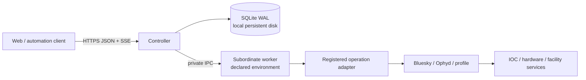

# Bluesky Experiment Controller Project Plan

| Field | Value |
|---|---|
| Status | Draft |
| Normative architecture | [RFC 0001](RFC_0001_EXPERIMENT_CONTROLLER_PRODUCT.md) |
| Reference prototype | [`bluesky_queueserver._experiment_controller`](src/bluesky_queueserver/_experiment_controller/) |
| Prototype guide | [Internal Experiment Controller Prototype](docs/source/experiment_controller_prototype.rst) |

## Goal

Deliver an authenticated, auditable execution service for one scientific instrument. Clients submit only reviewed, versioned operations. One controller owns durable state and dispatches work to one private Bluesky/Ophyd worker process.

The product is a clean replacement for selected QueueServer workflows, not a compatible QueueServer v2, full beamline control system, remote Python shell, or general workflow engine.

## MVP outcome

The MVP is a locally deployable service for one real workflow exercised against a deterministic simulator or test IOC. It proves the complete production control path without claiming approval for live hardware.

An authenticated client can:

1. inspect health, readiness, and the versioned operation catalog;
2. acquire and release control through a server-owned lease;
3. submit several schema-valid operations using optimistic queue revisions;
4. start durable queue execution and observe automatic dispatch through SSE;
5. add, cancel, replace, or reorder pending work while another operation runs;
6. disconnect or allow the initiating lease to expire while admitted work continues;
7. request the workflow's safe stop and prevent future dispatch;
8. correlate terminal operations with Bluesky run UIDs;
9. observe worker or controller loss become a durable fail-closed state;
10. recover only after prior execution authority is fenced and an operator acknowledges the condition;
11. restart without losing queue, queue-execution, attempt, lease, or audit history.

## Current baseline

The internal prototype already proves:

- frozen typed contracts and explicit operation states;
- closed Draft 7 parameter validation before persistence and execution;
- SQLite WAL storage, queue revisions, a persisted lease, dispatch blocking, and cursorable events;
- a strict private subprocess protocol with request correlation;
- one `simulated-count` operation executed by a fresh RunEngine with Ophyd simulated hardware;
- FIFO submission and explicit one-item dispatch;
- run-UID persistence;
- stale-revision rejection, schema rejection without mutation, deterministic lease expiry, restart persistence of terminal work, and subprocess cleanup;
- failure or worker transport loss blocking dispatch, with transport loss recorded as `unknown`.

The prototype does not yet provide:

- durable queue-execution records or automatic scheduling;
- execution-attempt and worker-instance evidence;
- an independent worker environment or profile-backed adapter;
- concurrent worker control and controller-liveness handling;
- safe stop, orphan exit, or execution-authority fencing;
- consistent fail-closed handling of every post-claim protocol failure;
- authenticated HTTPS or SSE delivery;
- deployment packaging or hardware support.

## Architecture summary



| Component | Owns | Does not own |
|---|---|---|
| Controller | Authentication, lease, queue, scheduler, attempts, recovery, events, worker lifecycle | Bluesky, Ophyd, device objects, scientific data storage |
| SQLite | Operations, queue executions, attempts, revisions, events, lease, recovery state | Bluesky documents or hardware state |
| Worker | RunEngine, reviewed catalog, device objects, one active attempt, stop/orphan behavior | Durable queue, authentication, database, public API, recovery authority |
| Operation adapter | Public schema, logical device resolution, result mapping, selected existing workflow | Generic namespace exposure or arbitrary client-selected callables |

The controller is the only durable authority. The worker is a disposable execution capsule. The process split exists for dependency and ordinary failure containment, not for HA, physical safety, or same-user security isolation.

## Core product semantics

### Registered operations

Clients submit `(operation_id, operation_version, parameters)`. The parameter object is closed and schema-valid. The worker reports the explicit catalog and immutable worker revision at startup.

There is no public arbitrary plan name, Python expression, object path, uploaded script, or generic `execute_plan` operation. `operation_version` tracks public meaning; `worker_revision` tracks implementation, profile, adapter, and dependency changes.

### Control lease and editable queue

The lease is time-bounded external mutation authority held by one authenticated principal. Queue execution is separate durable scheduler authorization.

The lease holder may add, cancel, replace, or reorder pending work while execution continues. Claimed and running work is immutable. The controller may continue dispatching admitted work after the browser disconnects or the initiating lease expires.

Scheduler claims, queue edits, and completion serialize through one queue revision and SQLite transaction boundary. The first release stops on every failed, interrupted, or unknown attempt and never retries automatically.

### Fail-closed execution

Every claim creates a durable attempt before worker contact. Any post-claim timeout, EOF, malformed response, process exit, correlation failure, or otherwise unprovable result becomes `unknown` or `interrupted` and blocks dispatch.

On controller loss, the worker accepts no new work, applies the operation's fixed orphan policy, and exits. The first release never reattaches to the old worker. A replacement starts only after the prior authority is fenced and recovery is explicitly acknowledged.

### Separate event and data planes

Controller events are durable lifecycle and audit records delivered through cursor-based SSE. Bluesky documents remain the scientific data stream. The controller stores run UIDs for correlation but is not a data catalog.

## Profile-collection adoption

Existing profile collections are operational environments, not clean importable libraries. Adoption MUST NOT require rewriting a complete profile before exposing one reviewed workflow.

A beamline worker may load its declared profile in the existing startup order and load a small registration adapter last:

```python
@operation(
    id="hxn.fly2d",
    version="1",
    input_model=Fly2DRequest,
    orphan_policy="request-stop",
)
def execute_fly2d(request, context):
    detectors = [
        DETECTOR_MAP[detector_id]
        for detector_id in request.detectors
    ]
    fast_motor = MOTOR_MAP[request.fast_axis]
    slow_motor = MOTOR_MAP[request.slow_axis]

    return context.profile["fly2dpd"](
        detectors,
        fast_motor,
        request.fast_start,
        request.fast_stop,
        request.fast_points,
        slow_motor,
        request.slow_start,
        request.slow_stop,
        request.slow_points,
        request.exposure,
    )
```

The adapter is private worker code. `context.profile` is the reviewed loaded namespace; device maps are explicit deployment mappings. The client supplies only logical identifiers and schema-valid values.

Only the path reachable from the registered operation needs immediate hardening:

- eliminate user-controlled `eval` and arbitrary object paths;
- replace arbitrary filesystem inputs with typed values or controlled artifact identifiers;
- propagate failures rather than swallowing exceptions;
- preserve cleanup and finalization;
- define safe-stop checkpoints and controller-loss behavior;
- return deterministic results and run UIDs.

QueueServer metadata and history may generate adapter candidates offline, but a developer must review and commit each registration. Interactive Bluesky or QueueServer may remain available for unmigrated workflows, provided it never shares simultaneous live authority with the new controller.

## MVP workflow contract

Select one actual NSLS-II workflow before implementing the worker SDK. Record:

- operation ID and version;
- request and result models;
- logical device identifiers;
- underlying profile plan or native implementation;
- worker revision inputs;
- normal success and known failure semantics;
- safe-stop boundary;
- controller-loss orphan policy;
- required Bluesky document routing;
- simulator or test-IOC acceptance scenarios;
- authorization policy.

The fastest default remains a bounded `count` operation with reviewed detector IDs, bounded `num`, optional nonnegative `delay`, returned run UIDs, safe stop at the next checkpoint, and an orphan policy that requests that stop before exit. Use it only if it represents the intended pilot; otherwise replace it with the real workflow rather than adding a second MVP operation.

## Delivery plan

### Phase 0: Fix product inputs

Deliverables:

- accepted or explicitly amended RFC 0001;
- selected workflow and beamline owner;
- reviewed operation contract;
- simulator or test IOC;
- selected authentication integration;
- declared profile/environment revision when using a profile adapter.

Exit criteria: the operation schema, result, safe stop, orphan policy, permissions, and acceptance scenarios are reviewable without referring to an arbitrary Python namespace.

### Phase 1: Create the product repository

Deliverables:

- new monorepo and product name;
- protocol, controller, storage, worker, worker SDK, web, deployment, and test packages;
- one locked development environment and task runner;
- prototype contracts, SQLite behavior, simulator, and high-value behavioral tests migrated without legacy manager imports;
- generated version/provenance metadata.

Exit criteria: the existing simulated operation runs end to end in the new repository with the same durable record and event behavior.

### Phase 2: Implement the durable editable scheduler

Deliverables:

- schema migrations for operations, queue executions, attempts, lease, events, metadata, and dispatch block;
- queue-execution start/stop and automatic FIFO claims;
- lease-independent dispatch of admitted work;
- revisioned add/cancel/replace/reorder while execution is active;
- transactional scheduler/edit race handling;
- completion and stop-on-non-success policies.

Exit criteria: a simulated overnight batch continues after client and lease loss, accepts authorized live edits, never double-claims an item, and stops on the first non-success.

### Phase 3: Implement the worker SDK and profile adapter

Deliverables:

- explicit operation registration and catalog validation;
- request/result model generation;
- logical device mapping;
- native operation and profile-backed adapter support behind the same worker protocol;
- profile and environment revision reporting;
- selected workflow adapter with no generic namespace escape hatch.

Exit criteria: the selected operation executes through its registered contract against simulation or a test IOC while unrelated profile plans remain unreachable.

### Phase 4: Make execution fail closed

Deliverables:

- durable attempt and worker-instance identity;
- concurrent execution, control, and liveness paths;
- safe-stop delivery and acknowledgement;
- fixed orphan behavior on controller loss;
- consistent unknown/interrupted transitions for all post-claim transport and protocol failures;
- old-worker exit evidence and fencing before replacement;
- fail-closed startup with no worker reattachment;
- explicit recovery acknowledgement.

Exit criteria: the failure matrix proves no ambiguous execution automatically retries, advances the queue, or permits a second worker authority.

### Phase 5: Add the public boundary

Minimum query capabilities:

- health and readiness;
- operation catalog and worker revision;
- current lease holder and expiry;
- queue snapshot and revision;
- queue-execution, operation, and attempt status;
- durable events after a cursor.

Minimum command capabilities:

- acquire, renew, release, and privileged override of the lease;
- submit and revisioned edit of pending work;
- start and stop queue execution;
- request safe stop and cancel queued work;
- acknowledge recovery.

Deliverables include one authentication integration, server-derived principals, typed HTTPS models, consistent errors and idempotency rules, and cursor-based SSE.

Exit criteria: an authenticated client completes the full MVP workflow without using private Python APIs or worker transport.

### Phase 6: Package one immutable deployment

Deliverables:

- controller and worker commands from one product release;
- independently pinned worker environment when required;
- local persistent SQLite location and permissions;
- standard process supervision without independent worker auto-restart;
- health/readiness integration;
- logs, provenance, backup, migration, rollback, and operator runbook.

Exit criteria: a clean host can deploy, run, stop, restart, inspect, back up, and roll back the simulator service using documented procedures.

### Phase 7: Complete pilot readiness

Exercise against simulation or a test IOC:

- schema and authorization rejection without mutation;
- live queue edits racing scheduler claims;
- lease expiry during unattended execution;
- explicit operation failure;
- safe-stop delivery;
- worker timeout, EOF, malformed response, and process exit;
- controller loss during execution;
- restart with a nonterminal attempt;
- fencing and duplicate-dispatch prevention;
- explicit recovery;
- event cursor reconnect;
- run-UID correlation.

Exit criteria: all MVP acceptance criteria pass, the operator runbook is exercised, and no live hardware is used until facility review approves the selected operation and deployment.

## MVP acceptance criteria

The MVP is done only when:

1. one reviewed operation runs through the public authenticated API;
2. no unregistered plan, function, device path, or script is remotely callable;
3. queue and event history survive restart;
4. the queue remains editable under a lease while execution continues;
5. admitted work continues without a connected client or live initiating lease;
6. stale edits cannot overwrite scheduler changes;
7. every execution has operation, attempt, actor, worker, and run-UID provenance;
8. safe stop and controller-loss orphan behavior are demonstrated;
9. every unprovable outcome blocks dispatch without retry;
10. prior worker authority is fenced before replacement;
11. recovery is authenticated and audited;
12. deployment and rollback are reproducible.

## Deferred until after MVP

- additional operation catalogs and worker types;
- polished operator UI and general client SDKs;
- workflow templates, batch composition, and adaptive orchestration;
- automatic retry policies;
- worker reattachment or transparent continuation;
- dynamic environment updates;
- QueueServer compatibility or runtime bridges;
- PostgreSQL, HA, active-active controllers, or SQLite over NFS;
- a Bluesky document store or data catalog;
- direct PV monitoring or arbitrary hardware control.

## Risks and controls

| Risk | Control |
|---|---|
| Beamlines cannot rewrite profile collections | Load profiles privately and register one adapter-backed workflow at a time. |
| Registered operations become boilerplate-heavy | Generate candidate models and adapters offline; require review before publication. |
| A generic escape hatch recreates QueueServer | Prohibit public callable names, object paths, scripts, and automatic discovery. |
| Worker failures create ambiguous physical state | Persist attempts before dispatch, fail unknown, block, fence, and require recovery. |
| Lease mechanics leak into operator UX | Present Take control, Release control, Stop after current, and Recovery required; hide lease IDs and revisions. |
| Scope expands into a beamline framework | Keep one operation, one controller, one worker, and one public contract through MVP. |
| SQLite is used outside its supported topology | Require one controller and local persistent storage; defer HA. |
| New and old systems both control hardware | Enforce deployment-level exclusive authority and separate state/endpoints. |

## Immediate next decisions

1. Accept or amend RFC 0001.
2. Select the single MVP workflow and its beamline owner.
3. Confirm whether the workflow uses a native operation or profile-backed adapter.
4. Select the authentication integration for the MVP.
5. Choose the product/repository name and create the clean monorepo.

Implementation begins with Phase 0 and proceeds vertically. Do not start with a generic worker SDK, broad web framework, compatibility mode, or UI platform.
