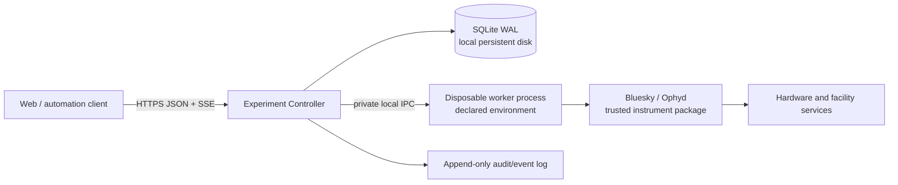

# Experiment Controller Redesign Proposal

## Decision

**Yes. With those compatibility constraints removed, a clean-break product is the right call.**

Do not build “QueueServer v2” as a compatible successor. Build a **smaller experiment execution controller** in a new repository, with a new protocol and deployment model. Keep current QueueServer in maintenance mode for security fixes and existing users; do not carry its transport, CLI, dynamic-execution, or profile semantics forward by default.

That changes the economics completely. The current architecture is expensive largely because it preserves broad, implicit flexibility:

- public direct ZMQ;
- remote interactive kernel access;
- arbitrary script/function execution;
- runtime plan/device introspection;
- three separately versioned packages;
- several parallel APIs for the same command;
- Redis-backed mutable records without a single transactional domain model.

If those are not requirements, retaining them is negative value.

## Current status

As of 2026-09-03, the first internal contract prototype is implemented in this repository under [`src/bluesky_queueserver/_experiment_controller/`](src/bluesky_queueserver/_experiment_controller/). [RFC 0001](RFC_0001_EXPERIMENT_CONTROLLER_PRODUCT.md) now captures the parent product and architecture decision for review.

The prototype proves:

- a private, typed controller/worker contract with stable operation identity and explicit operation versions;
- closed Draft 7 parameter validation before persistence or worker execution;
- a file-backed SQLite WAL store for queue revision, operation lifecycle, one control lease, dispatch blocking, and cursorable controller events;
- a strict private subprocess protocol and one trusted `simulated-count` operation using Ophyd simulated hardware and a fresh Bluesky RunEngine;
- durable FIFO submission and dispatch, including terminal run UIDs;
- conservative failure handling: operation failure or worker transport loss blocks dispatch, transport loss records `unknown`, and recovery requires an explicit acknowledgement;
- restart persistence, stale-revision rejection, schema rejection without mutation, deterministic lease expiry, and subprocess cleanup in the [focused behavioral suite](src/bluesky_queueserver/tests/test_experiment_controller.py).

The runnable surface and limitations are documented in the [prototype guide](docs/source/experiment_controller_prototype.rst). The prototype has no HTTP service, authentication integration, hardware support, public ZMQ, legacy compatibility layer, independent worker environment, concurrent worker control/liveness path, orphan-exit or fencing behavior, safe stop controls, or production deployment claim.

This implementation changes the sequencing risk, not the target architecture. It is a mergeable reference implementation inside the current distribution; the production product remains a separate-repository cutover so that legacy imports, protocols, and dependencies do not become accidental compatibility commitments.

## Product charter

Build an **authenticated, auditable, single-instrument execution service**.

It should answer only these questions well:

1. Which declared operation may run?
2. Who requested and authorized it?
3. What immutable parameters were used?
4. What is its durable lifecycle state?
5. Is the worker healthy and which deployment revision is active?
6. Can an operator safely stop, recover, or hand over control?
7. What happened, including after a restart?

It should **not** be:

- a remote Python shell;
- a generic Jupyter service;
- a public ZMQ broker;
- a runtime plugin installer;
- a generic, runtime-configurable profile-collection interpreter;
- a PV-monitoring or general hardware-control service;
- a data catalog;
- a replacement for hardware interlocks.

QueueServer is not, and should never be presented as, a physical safety system. EPICS/device interlocks remain authoritative.

## Recommended v1 architecture

Start with one repository and one product version containing one deployable controller and one subordinate worker executable.



### Controller

One process owns:

- durable queue, queue-execution, operation, and execution-attempt records;
- authorization and the operator-control lease;
- operation submissions, live queue editing, and scheduling;
- worker launch, liveness, and execution-authority fencing;
- audit/event publishing;
- health/readiness endpoints.

Use **one controller process per instrument deployment** initially. No clustering, no horizontal Uvicorn workers, no distributed coordination. The controller is the only durable state owner and public authority.

### Durable state

Use **SQLite in WAL mode on a local persistent filesystem** initially.

Why:

- eliminates Redis from the core deployment;
- gives ACID transactions, revisions, audit records, and event outbox in one store;
- is operationally simpler for a single-controller/single-host product;
- removes the current split between queue contents, in-memory manager state, and transient task results.

Require a local filesystem; do not support SQLite over NFS. Add PostgreSQL only when there is a demonstrated need for HA or multiple active controller instances.

Every state-changing request should atomically write:

- the domain mutation;
- the new queue revision;
- an immutable audit record;
- an append-only event.

### Worker

The worker is a separately launched, **subordinate and disposable execution process** in a declared environment. It owns the RunEngine, device objects, and one controller-authorized execution attempt at a time. It has no durable queue, database, authentication policy, recovery authority, or public endpoint.

The process boundary is retained for two reasons: the controller and instrument stack have different dependency sets, and a worker package conflict, native-library failure, memory leak, or blocked operation should not also own the durable control plane. It is not a physical-safety boundary, an HA design, or a security sandbox when both processes run as the same operating-system principal.

The controller should not import Bluesky, Ophyd, or beamline startup dependencies. It starts a configured worker command, such as a Python executable from a deployed environment, and communicates over private local IPC. This addresses the dependency-separation concern in [queueserver#365](https://github.com/bluesky/bluesky-queueserver/issues/365) without adopting its proposed in-service environment updates.

**Deployment updates are deployment operations.** The controller must not run `git pull`, `pixi install`, or arbitrary update hooks through its public API. A deployment builds and selects an immutable worker artifact/environment revision; the worker reports that revision at startup.

The production worker protocol must service control and liveness messages while an operation executes. The prototype's blocking execute request/response loop is insufficient because it cannot concurrently receive a safe-stop request or detect controller loss.

### Supervision and controller loss

Do not carry forward the legacy custom Watchdog, independently recoverable Manager/Worker peers, or transparent queue continuation. Use the deployment's standard process supervisor for the controller. The worker remains subordinate to one controller connection and must not be independently auto-restarted by the supervisor.

If that connection is lost, the worker accepts no new work, applies the operation's reviewed orphan policy, and exits. A restarted controller does not reconnect to it. The controller records any claimed or running attempt as `unknown` or `interrupted`, keeps dispatch blocked, and refuses to launch a replacement worker until the previous execution authority is proven to have ended. Operator acknowledgement is required to restore dispatch, but acknowledgement alone is not evidence that the old worker is gone.

### Public API

Use only:

- HTTPS JSON commands and queries;
- typed request/response models;
- Server-Sent Events with cursor/reconnect semantics for state and audit events.

No public ZMQ. No public raw worker protocol. No first-release WebSocket requirement.

A typed API avoids the current independent command definitions in manager dispatch, HTTP routes, REST mappings, sync SDK, async SDK, docs, and tests.

### Operation catalog

Do not accept arbitrary plan names or runtime Python objects.

A trusted worker deployment defines an explicit operation registry:

```python
class CountRequest(BaseModel):
    detectors: list[DetectorId]
    num: int = Field(ge=1, le=1000)
    delay: float = Field(ge=0)

@operation(
    id="count",
    version="1",
    input_model=CountRequest,
    safety_class="standard",
)
def count(request: CountRequest):
    yield from bp.count(...)
```

Remote clients submit:

```json
{
  "operation_id": "count",
  "operation_version": "1",
  "parameters": {
    "detectors": ["det1", "det2"],
    "num": 10
  }
}
```

The worker owns conversion from permitted logical identifiers to actual device objects. The client never traverses a worker namespace, submits Python expressions, or invokes arbitrary functions.

This replaces the dynamic namespace as the public contract; it does not require rewriting every underlying Bluesky plan.

### Profile-collection adoption

Existing NSLS-II profile collections are operational environments rather than ordinary importable libraries. They commonly depend on lexicographically executed startup files, a shared namespace of global devices and helpers, mutable RunEngine metadata, GUI-specific services, local files, and plans composed from many other plans. Requiring a complete profile rewrite before registering one operation would block adoption and discard working beamline knowledge.

Representative [SRX](https://github.com/NSLS2/srx-profile-collection), [HXN](https://github.com/NSLS2/hxn-profile-collection), and [ISS](https://github.com/NSLS2/iss-profile-collection) profiles show this pattern and also contain substantial workflow knowledge that should be reused rather than rewritten wholesale.

The first worker implementations may therefore load a declared profile collection in its existing startup order and load a small beamline-owned operation adapter last. The adapter is a façade inside the private worker; it is not a public QueueServer compatibility mode. For example:

```python
@operation(
    id="hxn.fly2d",
    version="1",
    input_model=Fly2DRequest,
    orphan_policy="request-stop",
)
def execute_fly2d(request, context):
    detectors = [
        DETECTOR_MAP[detector_id]
        for detector_id in request.detectors
    ]
    fast_motor = MOTOR_MAP[request.fast_axis]
    slow_motor = MOTOR_MAP[request.slow_axis]

    return context.profile["fly2dpd"](
        detectors,
        fast_motor,
        request.fast_start,
        request.fast_stop,
        request.fast_points,
        slow_motor,
        request.slow_start,
        request.slow_stop,
        request.slow_points,
        request.exposure,
    )
```

Here `context.profile` is a private namespace created from the reviewed deployment, while `DETECTOR_MAP` and `MOTOR_MAP` are explicit beamline-owned mappings. The callable name and object references are selected by committed worker code; the remote request supplies only schema-valid logical identifiers and values. The public API never accepts `eval`, a callable name, an object path, or an arbitrary configuration-file path.

Only the path reachable from a registered operation needs immediate hardening. For that path, the adapter or underlying plan must propagate failures, preserve cleanup, define safe-stop checkpoints and orphan behavior, and remove user-controlled namespace or filesystem access. Unrelated commissioning helpers and expert plans may remain in the profile but are not remotely callable through this product.

The operation version tracks the public schema and meaning. The worker revision tracks changes to the profile commit, adapter, dependencies, and implementation. Frequent compatible beamline-code updates therefore do not require inventing a new operation version.

Migration tooling should use existing QueueServer annotations, generated plan/device lists, permission files, and queue history to produce candidate adapters and catalog diffs. Generation is offline assistance only: a developer must review and commit each registration before the worker publishes it. There is no generic `execute_plan(name, args, kwargs)` escape hatch.

During commissioning, a beamline may continue using interactive Bluesky or QueueServer for workflows that have not graduated to registered operations. Migration is workflow by workflow, and the old and new systems must never hold simultaneous live authority over the same instrument.

### Control lease

Replace client-managed lock secrets with a server-owned, persisted **control lease**:

- an authenticated principal acquires an exclusive lease;
- the lease has an expiry and a documented handoff/revocation procedure;
- external queue mutation and execution control require the lease;
- every grant, renewal, expiry, handoff, and override is audited.

The lease authorizes commands; it is not a heartbeat for autonomous work. Expiry prevents new external mutations but does not cancel a running attempt or revoke operations already admitted to an active queue execution.

### Editable queue execution

A lease holder starts a durable queue execution at an observed queue revision. The record captures its UID, initiating principal, policy, starting revision, and admitted operations. The controller scheduler may continue dispatching those operations if the browser disconnects or the initiating lease expires.

While execution is active, whoever currently holds the lease may add operations, cancel or reorder pending operations, or replace a pending operation with a new immutable record. New operations explicitly join the active queue execution and retain their own submitting principal. Claimed and running work cannot be edited, and cancelled or replaced operations remain in the audit history.

Queue edits, scheduler claims, and queue-execution completion use the same optimistic revision and transaction boundary. Whichever commits first determines the next state: a claimed item is no longer editable, while a stale client edit fails and refreshes. The queue execution completes only when no attempt is active and no admitted operation remains queued; the first release does not wait indefinitely for later additions.

This gives the operator a live, editable overnight batch without requiring a browser or human lease to remain connected. A later lease holder can take control of the same active queue, and every mutation remains individually attributed and audited.

### Lifecycle model

Make state explicit and durable.

```text
submitted
  → queued
  → claimed
  → running
  → succeeded | failed | cancelled | aborted | interrupted | unknown
```

Before contacting the worker, the controller records a new execution-attempt identity, the operation claim, actor, worker revision, queue revision, and lifecycle event in one transaction. A restart must never silently reinterpret running work as completed.

Any timeout, EOF, worker exit, malformed or mismatched response, or other post-claim failure that makes the result unprovable produces `unknown` or `interrupted`, blocks dispatch, and requires operator recovery.

If the controller disappears while work is claimed or running:

1. the worker's independent liveness path detects the lost controller connection;
2. the worker accepts no new work, follows the operation's fixed orphan policy, and exits;
3. the deployment supervisor may restart the controller;
4. the controller records any nonterminal attempt as `unknown` or `interrupted` and remains not ready for dispatch;
5. no replacement worker starts until the previous worker's execution authority is proven to have ended;
6. an authenticated operator reviews the instrument state and explicitly acknowledges recovery.

The first release never reconnects to or resumes observing a surviving worker. Recovery may launch a fresh worker after fencing, but it never automatically retries, resumes, or reinterprets a possibly interrupted hardware operation.

### Control actions

Expose narrow, separate actions:

| Action | Intended behavior |
|---|---|
| `start_queue` | Persist scheduler authorization and begin consuming the editable queue. |
| `stop_queue` | Prevent another operation from being claimed; leave the current attempt unchanged. |
| `request_stop` | Finish the current operation's defined safe boundary and stop queue execution. |
| `pause` | Request a supported RunEngine pause when the selected workflow requires it. |
| `resume` | Resume a known paused execution when the selected workflow requires it. |
| `cancel_queued` | Remove work that has not begun. |
| `emergency_stop` | Explicitly privileged, audited, facility-specific emergency action; never a replacement for facility interlocks. |
| `acknowledge_recovery` | Confirm operator review after failure; it does not by itself prove that the previous worker has exited. |

Do not expose generic `script_upload`, `function_execute`, `kernel_interrupt`, or “unsafe stop” equivalents to ordinary users.

## Deliberate non-goals

These should be explicit product non-goals for the first release:

- importing existing QueueServer queues or histories;
- current CLI compatibility;
- QueueServer’s direct ZMQ protocol;
- IPython worker mode or Jupyter-console attachment;
- dynamic plan/device discovery;
- arbitrary function execution;
- uploaded scripts;
- spreadsheet-to-plan parsing;
- self-updating startup repositories;
- generic custom Python routers/modules;
- direct PV mutation or monitoring;
- HA / active-active controllers;
- reconnecting to or resuming observation of a surviving worker after controller restart.

An offline archival export tool may be useful later. It should not become a runtime compatibility bridge.

## What to reuse

Reuse **knowledge and behavioral evidence**, not the old architecture.

| Keep | Do not carry forward |
|---|---|
| Simulated beamline profiles | `RunEngineManager` as the domain boundary |
| Existing profile-collection plans behind explicit worker adapters | Runtime namespace reflection as the public API |
| QueueServer annotations, plan/device lists, permissions, and history as migration input | Automatic publication of every discovered callable or device |
| Plan pause/stop/recovery scenarios | Public ZMQ command protocol |
| RunEngine execution adapter concepts | Remote IPython kernel access |
| Worker isolation concept | Redis list mutation protocol |
| Queue/history lifecycle lessons | Client lock-key design |
| Existing hardware integration examples | Arbitrary script/function APIs |
| Behavioral test cases | HTTP global-resource singleton |
| Existing facility authentication requirements | Tiled-derived auth/database copy-paste |

The current `profile_ops.py`, `manager.py`, profile collections, and beamline-specific queue helpers are valuable sources of domain behavior and edge cases. They should feed explicit worker adapters and behavioral tests, not become the new controller's implementation foundation or public contract.

## Repository and release strategy

Create a new repository and monorepo layout:

```text
bluesky-experiment-controller/
  src/
    protocol/
    controller/
    worker/
    worker_sdk/
    web/
    storage/
  tests/
    unit/
    integration/
    simulator/
  deployment/
    systemd/
    compose/
    examples/
  docs/
```

One repository means:

- one version;
- atomic protocol/controller/SDK changes;
- one test matrix;
- one coordinated deployment bundle and release manifest;
- no “which sibling `main` branch happened to install” problem.

Do not split it into controller, API, and HTTP repositories until an external consumer has a real independent release need.

Avoid naming it `bluesky-queueserver` initially. This is a different product with intentionally incompatible semantics. A temporary working name such as **Bluesky Experiment Controller** is clearer.

## MVP scope and delivery sequence

The MVP is a locally deployable, authenticated service for **one reviewed operation**, exercised end to end against a deterministic simulator or test IOC. It proves the production control path without claiming approval for live hardware.

The fastest default is to promote the existing `simulated-count` path into a bounded `count` operation with reviewed logical detector IDs, `num`, optional nonnegative `delay`, returned run UIDs, a safe stop at the next Bluesky checkpoint, and an orphan policy that requests that stop before worker exit. Confirm that this represents the intended pilot workflow before freezing the contract; if it does not, replace it rather than adding a second MVP operation.

The MVP is complete when an authenticated client can:

1. inspect health, readiness, and the worker's versioned operation catalog;
2. acquire a control lease;
3. submit several schema-valid operations with optimistic queue revision control;
4. start a durable queue execution and observe automatic dispatch through SSE;
5. add, cancel, replace, or reorder pending work while another operation is running;
6. release or allow the initiating lease to expire while already admitted work continues;
7. correlate each terminal operation with its Bluesky run UID;
8. request the workflow's defined safe stop, stop future dispatch, and cancel queued work;
9. observe worker or controller loss become a durable fail-closed state;
10. recover only after the old execution authority is fenced and an operator acknowledges the condition;
11. restart the service without losing queue-execution, queue, attempt, lease, or audit history.

### Implementation order

1. **Select and freeze one workflow contract.** Name the operation, request schema, logical device identifiers, result shape, safe-stop boundary, controller-loss orphan policy, and simulator or test-IOC acceptance scenarios. Do not start with a generic plan API.
2. **Create the clean product repository.** Carry over only the prototype's contracts, SQLite transaction model, controller behavior, worker boundary, simulator, and high-value behavioral tests. Do not import the legacy manager, Redis queue, ZMQ API, or generic profile-loading machinery into the controller. The first worker may use a narrow deployment adapter to load the selected existing profile collection privately.
3. **Implement the durable editable scheduler.** Add the queue-execution record, operation admission, automatic FIFO claims, completion and stop policies, lease-independent dispatch of admitted work, and revisioned add/cancel/replace/reorder operations while execution is active.
4. **Make execution fail closed.** Persist execution attempts and worker-instance evidence; add a concurrent worker control/liveness path; map every post-claim transport or protocol failure to `unknown` or `interrupted`; mark nonterminal attempts fail-closed on startup; fence the previous worker before replacement; and keep worker reattachment out of scope.
5. **Define the narrow worker SDK and profile adapter.** Register the selected operation and input model, load the reviewed profile when needed, resolve logical identifiers through explicit maps, expose profile/environment revision metadata, and implement only the safe controls required by that workflow.
6. **Expose the minimum public API.** Implement health/readiness, catalog, lease acquisition/renewal, queue snapshot and revisioned edits, queue-execution start/stop, operation query, safe stop, queued cancellation, recovery acknowledgement, and cursor-based SSE. Select one authentication integration and derive principals server-side.
7. **Package one immutable deployment.** Produce controller and worker commands from one product version, pin the worker environment, configure local SQLite storage and process supervision, and document readiness, rollback, and database backup.
8. **Exercise the behavioral and failure matrix before a pilot.** Cover live queue edits racing scheduler claims, lease expiry during an overnight queue, worker exit, timeout, malformed response, controller loss during execution, restart with a nonterminal attempt, safe-stop delivery, fencing, duplicate-dispatch prevention, and explicit recovery against simulation or a test IOC.

Defer UI polish, client SDKs, workflow templates, multiple operation catalogs, PostgreSQL, HA, worker reattachment, dynamic environment updates, and legacy compatibility until this vertical slice works.

## Migration posture

| Existing system | New product |
|---|---|
| Security/correctness maintenance only | New feature development |
| Existing facility users remain supported | New pilots start clean |
| No runtime bridge | Separate deployment and state store |
| Legacy tests serve as behavior reference | New tests define intentional contract |
| No protocol compatibility promise | Explicit versioned protocol from day one |

A clean migration is safer than attempting to run both products against one Redis namespace, worker, or instrument. They must never share live control authority.

## Immediate decisions

[RFC 0001: Bluesky Experiment Controller Product Boundary](RFC_0001_EXPERIMENT_CONTROLLER_PRODUCT.md) remains the draft parent RFC. It proposes:

> **Replace QueueServer's general remote-execution model with an explicitly incompatible, single-controller experiment-execution product.**

Its foundational decisions are:

1. one monorepo, one product version, and one active controller per instrument deployment;
2. an explicit versioned operation catalog instead of remote Python or plan-namespace access;
3. durable transactional state plus an auditable control lease, initially backed by SQLite on local persistent storage;
4. a private, subordinate worker process retained for dependency and failure containment, with no public protocol or controller-managed package installation;
5. no worker reattachment in the first release: controller or worker loss fails closed, fences the old execution authority, and requires explicit recovery.

The two decisions needed to begin implementation are to accept or amend RFC 0001 and to select the single workflow that defines the MVP contract. Once those are fixed, implementation starts with the clean repository and fail-closed execution-attempt slice above—not with a broad web framework, generic worker SDK, or compatibility layer.
