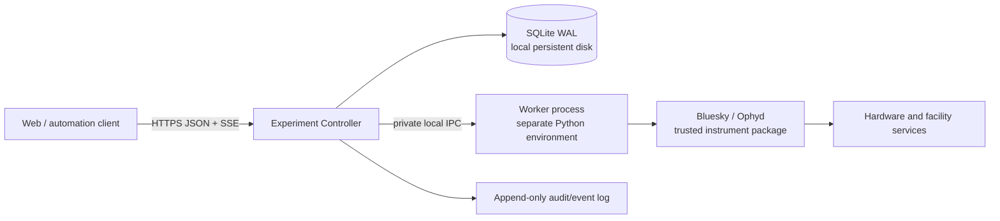

# Experiment Controller Redesign Proposal

## Decision

**Yes. With those compatibility constraints removed, a clean-break product is the right call.**

Do not build “QueueServer v2” as a compatible successor. Build a **smaller experiment execution controller** in a new repository, with a new protocol and deployment model. Keep current QueueServer in maintenance mode for security fixes and existing users; do not carry its transport, CLI, dynamic-execution, or profile semantics forward by default.

That changes the economics completely. The current architecture is expensive largely because it preserves broad, implicit flexibility:

- public direct ZMQ;
- remote interactive kernel access;
- arbitrary script/function execution;
- runtime plan/device introspection;
- three separately versioned packages;
- several parallel APIs for the same command;
- Redis-backed mutable records without a single transactional domain model.

If those are not requirements, retaining them is negative value.

## Product charter

Build an **authenticated, auditable, single-instrument execution service**.

It should answer only these questions well:

1. Which declared operation may run?
2. Who requested and authorized it?
3. What immutable parameters were used?
4. What is its durable lifecycle state?
5. Is the worker healthy and which deployment revision is active?
6. Can an operator safely stop, recover, or hand over control?
7. What happened, including after a restart?

It should **not** be:

- a remote Python shell;
- a generic Jupyter service;
- a public ZMQ broker;
- a runtime plugin installer;
- a profile-collection interpreter;
- a PV-monitoring or general hardware-control service;
- a data catalog;
- a replacement for hardware interlocks.

QueueServer is not, and should never be presented as, a physical safety system. EPICS/device interlocks remain authoritative.

## Recommended v1 architecture

Start with one repository, one version, one deployable controller.



### Controller

One process owns:

- durable queue and execution records;
- authorization and operator-control lease;
- operation submissions;
- queue scheduling;
- worker lifecycle;
- audit/event publishing;
- health/readiness endpoints.

Use **one controller process per instrument deployment** initially. No clustering, no horizontal Uvicorn workers, no distributed coordination.

### Durable state

Use **SQLite in WAL mode on a local persistent filesystem** initially.

Why:

- eliminates Redis from the core deployment;
- gives ACID transactions, revisions, audit records, and event outbox in one store;
- is operationally simpler for a single-controller/single-host product;
- removes the current split between queue contents, in-memory manager state, and transient task results.

Require a local filesystem; do not support SQLite over NFS. Add PostgreSQL only when there is a demonstrated need for HA or multiple active controller instances.

Every state-changing request should atomically write:

- the domain mutation;
- the new queue revision;
- an immutable audit record;
- an append-only event.

### Worker

The worker is a separately launched process in a **declared worker environment**.

The controller should not import Bluesky, Ophyd, or beamline startup dependencies. It starts a configured worker command, such as a Python executable from a deployed environment, and communicates over private local IPC.

This solves the core concern in [queueserver#365](https://github.com/bluesky/bluesky-queueserver/issues/365) without making QueueServer responsible for Pixi, Conda, Git, or package installation.

**Deployment updates are deployment operations.** The controller must not run `git pull`, `pixi install`, or arbitrary update hooks through its public API. A deployment selects an immutable worker artifact/environment revision; the worker reports that revision at startup.

### Public API

Use only:

- HTTPS JSON commands and queries;
- typed request/response models;
- Server-Sent Events with cursor/reconnect semantics for state and audit events.

No public ZMQ. No public raw worker protocol. No first-release WebSocket requirement.

A typed API avoids the current independent command definitions in manager dispatch, HTTP routes, REST mappings, sync SDK, async SDK, docs, and tests.

### Operation catalog

Do not accept arbitrary plan names or runtime Python objects.

A trusted worker deployment defines an explicit operation registry:

```python
class CountRequest(BaseModel):
    detectors: list[DetectorId]
    num: int = Field(ge=1, le=1000)
    delay: float = Field(ge=0)

@operation(
    id="count",
    version="1",
    input_model=CountRequest,
    safety_class="standard",
)
def count(request: CountRequest):
    yield from bp.count(...)
```

Remote clients submit:

```json
{
  "operation_id": "count",
  "operation_version": "1",
  "parameters": {
    "detectors": ["det1", "det2"],
    "num": 10
  }
}
```

The worker owns conversion from permitted logical identifiers to actual device objects. The client never traverses a worker namespace, submits Python expressions, or invokes arbitrary functions.

This intentionally replaces the current dynamic `profile_ops.py` model, not ports it.

### Control lease

Replace client-managed lock secrets with a server-owned, persisted **control lease**:

- an authenticated principal acquires an exclusive lease;
- the lease has an expiry and a documented handoff/revocation procedure;
- queue mutation and execution control require the lease;
- every grant, renewal, expiry, handoff, and override is audited.

This is simpler for operators than distributing a lock string and safer than an emergency lock key whose lifecycle is disconnected from identity.

### Lifecycle model

Make state explicit and durable.

```text
submitted
  → queued
  → claimed
  → running
  → succeeded | failed | cancelled | aborted | interrupted | unknown
```

A worker restart must **never silently reinterpret** a running operation as completed.

On controller or worker loss:

1. mark the execution attempt `unknown` or `interrupted`;
2. stop automatic dispatch;
3. require worker reconciliation and operator acknowledgement;
4. only then allow new work.

Automatic recovery may restart a process. It must not automatically resume a possibly interrupted hardware operation.

### Control actions

Expose narrow, separate actions:

| Action | Intended behavior |
|---|---|
| `request_stop` | Finish the safe current boundary; do not dispatch another item. |
| `pause` | Request a supported RunEngine pause. |
| `resume` | Resume a known paused execution. |
| `cancel_queued` | Remove work that has not begun. |
| `emergency_stop` | Explicitly privileged, audited, facility-specific emergency action. |
| `recover_worker` | Operator-only reconciliation after worker failure. |

Do not expose generic `script_upload`, `function_execute`, `kernel_interrupt`, or “unsafe stop” equivalents to ordinary users.

## Deliberate non-goals

These should be explicit product non-goals for the first release:

- importing existing QueueServer queues or histories;
- current CLI compatibility;
- QueueServer’s direct ZMQ protocol;
- IPython worker mode or Jupyter-console attachment;
- dynamic plan/device discovery;
- arbitrary function execution;
- uploaded scripts;
- spreadsheet-to-plan parsing;
- self-updating startup repositories;
- generic custom Python routers/modules;
- direct PV mutation or monitoring;
- HA / active-active controllers.

An offline archival export tool may be useful later. It should not become a runtime compatibility bridge.

## What to reuse

Reuse **knowledge and behavioral evidence**, not the old architecture.

| Keep | Do not carry forward |
|---|---|
| Simulated beamline profiles | `RunEngineManager` as the domain boundary |
| Plan pause/stop/recovery scenarios | Public ZMQ command protocol |
| RunEngine execution adapter concepts | Dynamic namespace reflection |
| Worker isolation concept | Remote IPython kernel access |
| Queue/history lifecycle lessons | Redis list mutation protocol |
| Allowlist and permission lessons | Client lock-key design |
| Existing hardware integration examples | Arbitrary script/function APIs |
| Behavioral test cases | HTTP global-resource singleton |
| Existing facility authentication requirements | Tiled-derived auth/database copy-paste |

The current `profile_ops.py` and `manager.py` are especially valuable as reference material for edge cases, but they should not be the initial v1 implementation foundation.

## Repository and release strategy

Create a new repository and monorepo layout:

```text
bluesky-experiment-controller/
  src/
    protocol/
    controller/
    worker/
    worker_sdk/
    web/
    storage/
  tests/
    unit/
    integration/
    simulator/
  deployment/
    systemd/
    compose/
    examples/
  docs/
```

One repository means:

- one version;
- atomic protocol/controller/SDK changes;
- one test matrix;
- one deployment artifact;
- no “which sibling `main` branch happened to install” problem.

Do not split it into controller, API, and HTTP repositories until an external consumer has a real independent release need.

Avoid naming it `bluesky-queueserver` initially. This is a different product with intentionally incompatible semantics. A temporary working name such as **Bluesky Experiment Controller** is clearer.

## First production slice

The first release should prove one complete safe workflow:

1. deploy a versioned worker environment;
2. load an explicit operation catalog;
3. authenticate an operator;
4. acquire a control lease;
5. submit one validated operation;
6. execute it with a simulated device set;
7. stream durable lifecycle events;
8. stop safely;
9. restart controller or worker;
10. require explicit recovery for an interrupted operation;
11. retain a complete audit trail.

Only after that should the project add:

- reviewed submissions;
- batch workflows;
- richer operation catalogs;
- data-document links;
- facility-specific authorization;
- additional worker types;
- user-facing queue editors.

That is a coherent real product. It is much smaller than current QueueServer while solving the parts that matter operationally.

## Migration posture

| Existing system | New product |
|---|---|
| Security/correctness maintenance only | New feature development |
| Existing facility users remain supported | New pilots start clean |
| No runtime bridge | Separate deployment and state store |
| Legacy tests serve as behavior reference | New tests define intentional contract |
| No protocol compatibility promise | Explicit versioned protocol from day one |

A clean migration is safer than attempting to run both products against one Redis namespace, worker, or instrument. They must never share live control authority.

## Next

Create one parent RFC with this decision:

> **Replace QueueServer’s general remote-execution model with an explicitly incompatible, single-controller experiment-execution product.**

Its first three accepted architecture decisions should be:

1. one monorepo and one deployable controller;
2. explicit operation catalog instead of remote Python/plan namespace access;
3. durable transactional state plus auditable control lease, initially backed by SQLite on local persistent storage.

Then select **one actual NSLS-II workflow** to define the first operation catalog and simulator acceptance tests. That workflow—not legacy QueueServer surface area—should determine the first release boundary.
