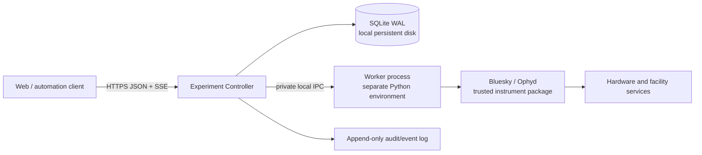

# Experiment Controller Redesign Proposal

## Decision

**Yes. With those compatibility constraints removed, a clean-break product is the right call.**

Do not build “QueueServer v2” as a compatible successor. Build a **smaller experiment execution controller** in a new repository, with a new protocol and deployment model. Keep current QueueServer in maintenance mode for security fixes and existing users; do not carry its transport, CLI, dynamic-execution, or profile semantics forward by default.

That changes the economics completely. The current architecture is expensive largely because it preserves broad, implicit flexibility:

- public direct ZMQ;
- remote interactive kernel access;
- arbitrary script/function execution;
- runtime plan/device introspection;
- three separately versioned packages;
- several parallel APIs for the same command;
- Redis-backed mutable records without a single transactional domain model.

If those are not requirements, retaining them is negative value.

## Current status

As of 2026-09-03, the first internal contract prototype is implemented in this repository under [`src/bluesky_queueserver/_experiment_controller/`](src/bluesky_queueserver/_experiment_controller/). [RFC 0001](RFC_0001_EXPERIMENT_CONTROLLER_PRODUCT.md) now captures the parent product and architecture decision for review.

The prototype proves:

- a private, typed controller/worker contract with stable operation identity and explicit operation versions;
- closed Draft 7 parameter validation before persistence or worker execution;
- a file-backed SQLite WAL store for queue revision, operation lifecycle, one control lease, dispatch blocking, and cursorable controller events;
- a strict private subprocess protocol and one trusted `simulated-count` operation using Ophyd simulated hardware and a fresh Bluesky RunEngine;
- durable FIFO submission and dispatch, including terminal run UIDs;
- conservative failure handling: operation failure or worker transport loss blocks dispatch, transport loss records `unknown`, and recovery requires an explicit acknowledgement;
- restart persistence, stale-revision rejection, schema rejection without mutation, deterministic lease expiry, and subprocess cleanup in the [focused behavioral suite](src/bluesky_queueserver/tests/test_experiment_controller.py).

The runnable surface and limitations are documented in the [prototype guide](docs/source/experiment_controller_prototype.rst). The prototype has no HTTP service, authentication integration, hardware support, public ZMQ, legacy compatibility layer, independent worker environment, safe stop controls, or production deployment claim.

This implementation changes the sequencing risk, not the target architecture. It is a mergeable reference implementation inside the current distribution; the production product remains a separate-repository cutover so that legacy imports, protocols, and dependencies do not become accidental compatibility commitments.

## Product charter

Build an **authenticated, auditable, single-instrument execution service**.

It should answer only these questions well:

1. Which declared operation may run?
2. Who requested and authorized it?
3. What immutable parameters were used?
4. What is its durable lifecycle state?
5. Is the worker healthy and which deployment revision is active?
6. Can an operator safely stop, recover, or hand over control?
7. What happened, including after a restart?

It should **not** be:

- a remote Python shell;
- a generic Jupyter service;
- a public ZMQ broker;
- a runtime plugin installer;
- a profile-collection interpreter;
- a PV-monitoring or general hardware-control service;
- a data catalog;
- a replacement for hardware interlocks.

QueueServer is not, and should never be presented as, a physical safety system. EPICS/device interlocks remain authoritative.

## Recommended v1 architecture

Start with one repository, one version, one deployable controller.



### Controller

One process owns:

- durable queue and execution records;
- authorization and operator-control lease;
- operation submissions;
- queue scheduling;
- worker lifecycle;
- audit/event publishing;
- health/readiness endpoints.

Use **one controller process per instrument deployment** initially. No clustering, no horizontal Uvicorn workers, no distributed coordination.

### Durable state

Use **SQLite in WAL mode on a local persistent filesystem** initially.

Why:

- eliminates Redis from the core deployment;
- gives ACID transactions, revisions, audit records, and event outbox in one store;
- is operationally simpler for a single-controller/single-host product;
- removes the current split between queue contents, in-memory manager state, and transient task results.

Require a local filesystem; do not support SQLite over NFS. Add PostgreSQL only when there is a demonstrated need for HA or multiple active controller instances.

Every state-changing request should atomically write:

- the domain mutation;
- the new queue revision;
- an immutable audit record;
- an append-only event.

### Worker

The worker is a separately launched process in a **declared worker environment**.

The controller should not import Bluesky, Ophyd, or beamline startup dependencies. It starts a configured worker command, such as a Python executable from a deployed environment, and communicates over private local IPC.

This solves the core concern in [queueserver#365](https://github.com/bluesky/bluesky-queueserver/issues/365) without making QueueServer responsible for Pixi, Conda, Git, or package installation.

**Deployment updates are deployment operations.** The controller must not run `git pull`, `pixi install`, or arbitrary update hooks through its public API. A deployment selects an immutable worker artifact/environment revision; the worker reports that revision at startup.

### Supervision and controller loss

Do not carry forward the legacy custom Watchdog or transparent queue continuation after manager restart as a first-release requirement. A controller-only death while its same-host worker and supervisor remain healthy is a narrow process-local failure, typically caused by a controller logic/dependency defect or a signal directed at that process. Known deterministic causes belong in release testing and should be fixed, not normalized as an operating mode. Host, service, and broad resource failures are more likely to affect the complete deployment.

Use the deployment's standard process supervisor to restart the controller. If the controller connection is lost, the worker must accept no new work and apply a documented orphan policy to the current operation: finish, pause at a safe boundary, or stop, depending on the reviewed operation/runtime contract.

After restart, the controller reads durable state and reconciles the exact operation and worker-session identity. A proven match may allow it to resume observing that operation; it must not imply permission to dispatch the next item. A missing worker, mismatched identity, or unverifiable outcome becomes `unknown`, keeps dispatch blocked, and requires explicit operator recovery. Transparent continuation based only on surviving process memory is not a goal.

### Public API

Use only:

- HTTPS JSON commands and queries;
- typed request/response models;
- Server-Sent Events with cursor/reconnect semantics for state and audit events.

No public ZMQ. No public raw worker protocol. No first-release WebSocket requirement.

A typed API avoids the current independent command definitions in manager dispatch, HTTP routes, REST mappings, sync SDK, async SDK, docs, and tests.

### Operation catalog

Do not accept arbitrary plan names or runtime Python objects.

A trusted worker deployment defines an explicit operation registry:

```python
class CountRequest(BaseModel):
    detectors: list[DetectorId]
    num: int = Field(ge=1, le=1000)
    delay: float = Field(ge=0)

@operation(
    id="count",
    version="1",
    input_model=CountRequest,
    safety_class="standard",
)
def count(request: CountRequest):
    yield from bp.count(...)
```

Remote clients submit:

```json
{
  "operation_id": "count",
  "operation_version": "1",
  "parameters": {
    "detectors": ["det1", "det2"],
    "num": 10
  }
}
```

The worker owns conversion from permitted logical identifiers to actual device objects. The client never traverses a worker namespace, submits Python expressions, or invokes arbitrary functions.

This intentionally replaces the current dynamic `profile_ops.py` model, not ports it.

### Control lease

Replace client-managed lock secrets with a server-owned, persisted **control lease**:

- an authenticated principal acquires an exclusive lease;
- the lease has an expiry and a documented handoff/revocation procedure;
- queue mutation and execution control require the lease;
- every grant, renewal, expiry, handoff, and override is audited.

This is simpler for operators than distributing a lock string and safer than an emergency lock key whose lifecycle is disconnected from identity.

### Lifecycle model

Make state explicit and durable.

```text
submitted
  → queued
  → claimed
  → running
  → succeeded | failed | cancelled | aborted | interrupted | unknown
```

A worker restart must **never silently reinterpret** a running operation as completed.

Controller-process restart is not a normal execution path and does not promise uninterrupted queue processing. If a controller disappears while work is claimed or running:

1. the worker accepts no new work and follows the operation's documented orphan policy;
2. the deployment supervisor may restart the controller;
3. the controller reconciles durable operation identity against the worker's exact session and execution identity;
4. a proven match may resume observation of the current operation, but not automatic dispatch of another item;
5. an absent worker, identity mismatch, or unverifiable outcome becomes `unknown` or `interrupted` and requires operator acknowledgement.

Worker or transport loss after claim always stops automatic dispatch. Recovery may restart a process, but it must not automatically retry, resume, or reinterpret a possibly interrupted hardware operation.

### Control actions

Expose narrow, separate actions:

| Action | Intended behavior |
|---|---|
| `request_stop` | Finish the safe current boundary; do not dispatch another item. |
| `pause` | Request a supported RunEngine pause. |
| `resume` | Resume a known paused execution. |
| `cancel_queued` | Remove work that has not begun. |
| `emergency_stop` | Explicitly privileged, audited, facility-specific emergency action. |
| `recover_worker` | Operator-only reconciliation after worker failure. |

Do not expose generic `script_upload`, `function_execute`, `kernel_interrupt`, or “unsafe stop” equivalents to ordinary users.

## Deliberate non-goals

These should be explicit product non-goals for the first release:

- importing existing QueueServer queues or histories;
- current CLI compatibility;
- QueueServer’s direct ZMQ protocol;
- IPython worker mode or Jupyter-console attachment;
- dynamic plan/device discovery;
- arbitrary function execution;
- uploaded scripts;
- spreadsheet-to-plan parsing;
- self-updating startup repositories;
- generic custom Python routers/modules;
- direct PV mutation or monitoring;
- HA / active-active controllers.

An offline archival export tool may be useful later. It should not become a runtime compatibility bridge.

## What to reuse

Reuse **knowledge and behavioral evidence**, not the old architecture.

| Keep | Do not carry forward |
|---|---|
| Simulated beamline profiles | `RunEngineManager` as the domain boundary |
| Plan pause/stop/recovery scenarios | Public ZMQ command protocol |
| RunEngine execution adapter concepts | Dynamic namespace reflection |
| Worker isolation concept | Remote IPython kernel access |
| Queue/history lifecycle lessons | Redis list mutation protocol |
| Allowlist and permission lessons | Client lock-key design |
| Existing hardware integration examples | Arbitrary script/function APIs |
| Behavioral test cases | HTTP global-resource singleton |
| Existing facility authentication requirements | Tiled-derived auth/database copy-paste |

The current `profile_ops.py` and `manager.py` are especially valuable as reference material for edge cases, but they should not be the initial v1 implementation foundation.

## Repository and release strategy

Create a new repository and monorepo layout:

```text
bluesky-experiment-controller/
  src/
    protocol/
    controller/
    worker/
    worker_sdk/
    web/
    storage/
  tests/
    unit/
    integration/
    simulator/
  deployment/
    systemd/
    compose/
    examples/
  docs/
```

One repository means:

- one version;
- atomic protocol/controller/SDK changes;
- one test matrix;
- one deployment artifact;
- no “which sibling `main` branch happened to install” problem.

Do not split it into controller, API, and HTTP repositories until an external consumer has a real independent release need.

Avoid naming it `bluesky-queueserver` initially. This is a different product with intentionally incompatible semantics. A temporary working name such as **Bluesky Experiment Controller** is clearer.

## First production slice

The first release should still prove one complete safe workflow. The prototype establishes part of that path, but it does not satisfy the production boundary by itself.

| Capability | Prototype evidence | Remaining production gap |
|---|---|---|
| Deploy a versioned worker environment | Worker reports `prototype-simulator-v1` across a separate process boundary | Build and supervise an immutable worker artifact in an environment independent of the controller |
| Load an explicit operation catalog | `simulated-count` version `1` publishes a closed schema | Select one real NSLS-II workflow and define its reviewed catalog through a worker SDK |
| Authenticate an operator | Trusted `subject` is carried through lease and events | Authenticate the caller and derive the subject at the public boundary |
| Acquire a control lease | One lease is persisted with identity and expiry checks | Define handoff, revocation, privileged override, and operator UX |
| Submit one validated operation | Catalog identity, revision, JSON representation, and schema are checked before mutation | Expose the contract through the typed public API |
| Execute against simulated devices | A subprocess runs Bluesky `count` with Ophyd simulated hardware and returns run UIDs | Exercise the selected facility workflow and independently deployed worker |
| Stream durable lifecycle events | Ordered controller events support `after_event_id` resumption | Add authenticated SSE delivery, retention, and reconnect behavior |
| Stop safely | Not implemented | Define and test request-stop, pause, cancellation, and safe-boundary behavior |
| Restart the controller | Reopening SQLite preserves terminal records and events | Use the deployment supervisor; define worker orphan behavior and exact-identity reconciliation. Transparent queue continuation is not a goal |
| Recover worker loss | Worker transport loss is recorded as `unknown` and blocks dispatch | Add worker supervision, reconciliation, and safe operator recovery |
| Require explicit recovery | Failed or unknown work blocks dispatch until acknowledged | Reconcile worker state and define authorized recovery actions |
| Retain a complete audit trail | Actor-tagged lifecycle events commit with domain changes | Bind actors to authenticated principals and define audit retention/export |

The first production slice is complete only when every remaining gap above is resolved for one real workflow. Only after that should the project add:

- reviewed submissions;
- batch workflows;
- richer operation catalogs;
- data-document links beyond run-UID correlation;
- additional worker types;
- user-facing queue editors.

That remains a coherent, smaller product rather than a compatibility rebuild of current QueueServer.

## Migration posture

| Existing system | New product |
|---|---|
| Security/correctness maintenance only | New feature development |
| Existing facility users remain supported | New pilots start clean |
| No runtime bridge | Separate deployment and state store |
| Legacy tests serve as behavior reference | New tests define intentional contract |
| No protocol compatibility promise | Explicit versioned protocol from day one |

A clean migration is safer than attempting to run both products against one Redis namespace, worker, or instrument. They must never share live control authority.

## RFC sequence and next decision

[RFC 0001: Bluesky Experiment Controller Product Boundary](RFC_0001_EXPERIMENT_CONTROLLER_PRODUCT.md) is the draft parent RFC for this direction. It proposes:

> **Replace QueueServer’s general remote-execution model with an explicitly incompatible, single-controller experiment-execution product.**

Its foundational decisions are:

1. one monorepo, one product version, and one active controller per instrument deployment;
2. an explicit versioned operation catalog instead of remote Python or plan-namespace access;
3. durable transactional state plus an auditable control lease, initially backed by SQLite on local persistent storage;
4. a private worker process in a declared environment, with no public worker protocol or controller-managed package installation;
5. conservative unknown-state recovery that never silently retries or reinterprets interrupted work.

Review and acceptance of RFC 0001 is the next architecture decision. Acceptance approves the product boundary and invariants, not production readiness or the prototype’s exact Python/stdio interfaces.

After that decision, select **one actual NSLS-II workflow** to define the first operation catalog, simulator acceptance tests, safe control behavior, and deployment boundary. That workflow—not legacy QueueServer surface area—determines the first release.
