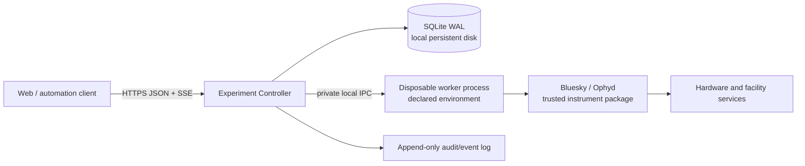

# Experiment Controller Redesign Proposal

## Decision

**Yes. With those compatibility constraints removed, a clean-break product is the right call.**

Do not build “QueueServer v2” as a compatible successor. Build a **smaller experiment execution controller** in a new repository, with a new protocol and deployment model. Keep current QueueServer in maintenance mode for security fixes and existing users; do not carry its transport, CLI, dynamic-execution, or profile semantics forward by default.

That changes the economics completely. The current architecture is expensive largely because it preserves broad, implicit flexibility:

- public direct ZMQ;
- remote interactive kernel access;
- arbitrary script/function execution;
- runtime plan/device introspection;
- three separately versioned packages;
- several parallel APIs for the same command;
- Redis-backed mutable records without a single transactional domain model.

If those are not requirements, retaining them is negative value.

## Current status

As of 2026-09-03, the first internal contract prototype is implemented in this repository under [`src/bluesky_queueserver/_experiment_controller/`](src/bluesky_queueserver/_experiment_controller/). [RFC 0001](RFC_0001_EXPERIMENT_CONTROLLER_PRODUCT.md) now captures the parent product and architecture decision for review.

The prototype proves:

- a private, typed controller/worker contract with stable operation identity and explicit operation versions;
- closed Draft 7 parameter validation before persistence or worker execution;
- a file-backed SQLite WAL store for queue revision, operation lifecycle, one control lease, dispatch blocking, and cursorable controller events;
- a strict private subprocess protocol and one trusted `simulated-count` operation using Ophyd simulated hardware and a fresh Bluesky RunEngine;
- durable FIFO submission and dispatch, including terminal run UIDs;
- conservative failure handling: operation failure or worker transport loss blocks dispatch, transport loss records `unknown`, and recovery requires an explicit acknowledgement;
- restart persistence, stale-revision rejection, schema rejection without mutation, deterministic lease expiry, and subprocess cleanup in the [focused behavioral suite](src/bluesky_queueserver/tests/test_experiment_controller.py).

The runnable surface and limitations are documented in the [prototype guide](docs/source/experiment_controller_prototype.rst). The prototype has no HTTP service, authentication integration, hardware support, public ZMQ, legacy compatibility layer, independent worker environment, concurrent worker control/liveness path, orphan-exit or fencing behavior, safe stop controls, or production deployment claim.

This implementation changes the sequencing risk, not the target architecture. It is a mergeable reference implementation inside the current distribution; the production product remains a separate-repository cutover so that legacy imports, protocols, and dependencies do not become accidental compatibility commitments.

## Product charter

Build an **authenticated, auditable, single-instrument execution service**.

It should answer only these questions well:

1. Which declared operation may run?
2. Who requested and authorized it?
3. What immutable parameters were used?
4. What is its durable lifecycle state?
5. Is the worker healthy and which deployment revision is active?
6. Can an operator safely stop, recover, or hand over control?
7. What happened, including after a restart?

It should **not** be:

- a remote Python shell;
- a generic Jupyter service;
- a public ZMQ broker;
- a runtime plugin installer;
- a profile-collection interpreter;
- a PV-monitoring or general hardware-control service;
- a data catalog;
- a replacement for hardware interlocks.

QueueServer is not, and should never be presented as, a physical safety system. EPICS/device interlocks remain authoritative.

## Recommended v1 architecture

Start with one repository and one product version containing one deployable controller and one subordinate worker executable.



### Controller

One process owns:

- durable queue, operation, and execution-attempt records;
- authorization and the operator-control lease;
- operation submissions and queue scheduling;
- worker launch, liveness, and execution-authority fencing;
- audit/event publishing;
- health/readiness endpoints.

Use **one controller process per instrument deployment** initially. No clustering, no horizontal Uvicorn workers, no distributed coordination. The controller is the only durable state owner and public authority.

### Durable state

Use **SQLite in WAL mode on a local persistent filesystem** initially.

Why:

- eliminates Redis from the core deployment;
- gives ACID transactions, revisions, audit records, and event outbox in one store;
- is operationally simpler for a single-controller/single-host product;
- removes the current split between queue contents, in-memory manager state, and transient task results.

Require a local filesystem; do not support SQLite over NFS. Add PostgreSQL only when there is a demonstrated need for HA or multiple active controller instances.

Every state-changing request should atomically write:

- the domain mutation;
- the new queue revision;
- an immutable audit record;
- an append-only event.

### Worker

The worker is a separately launched, **subordinate and disposable execution process** in a declared environment. It owns the RunEngine, device objects, and one controller-authorized execution attempt at a time. It has no durable queue, database, authentication policy, recovery authority, or public endpoint.

The process boundary is retained for two reasons: the controller and instrument stack have different dependency sets, and a worker package conflict, native-library failure, memory leak, or blocked operation should not also own the durable control plane. It is not a physical-safety boundary, an HA design, or a security sandbox when both processes run as the same operating-system principal.

The controller should not import Bluesky, Ophyd, or beamline startup dependencies. It starts a configured worker command, such as a Python executable from a deployed environment, and communicates over private local IPC. This addresses the dependency-separation concern in [queueserver#365](https://github.com/bluesky/bluesky-queueserver/issues/365) without adopting its proposed in-service environment updates.

**Deployment updates are deployment operations.** The controller must not run `git pull`, `pixi install`, or arbitrary update hooks through its public API. A deployment builds and selects an immutable worker artifact/environment revision; the worker reports that revision at startup.

The production worker protocol must service control and liveness messages while an operation executes. The prototype's blocking execute request/response loop is insufficient because it cannot concurrently receive a safe-stop request or detect controller loss.

### Supervision and controller loss

Do not carry forward the legacy custom Watchdog, independently recoverable Manager/Worker peers, or transparent queue continuation. Use the deployment's standard process supervisor for the controller. The worker remains subordinate to one controller connection and must not be independently auto-restarted by the supervisor.

If that connection is lost, the worker accepts no new work, applies the operation's reviewed orphan policy, and exits. A restarted controller does not reconnect to it. The controller records any claimed or running attempt as `unknown` or `interrupted`, keeps dispatch blocked, and refuses to launch a replacement worker until the previous execution authority is proven to have ended. Operator acknowledgement is required to restore dispatch, but acknowledgement alone is not evidence that the old worker is gone.

### Public API

Use only:

- HTTPS JSON commands and queries;
- typed request/response models;
- Server-Sent Events with cursor/reconnect semantics for state and audit events.

No public ZMQ. No public raw worker protocol. No first-release WebSocket requirement.

A typed API avoids the current independent command definitions in manager dispatch, HTTP routes, REST mappings, sync SDK, async SDK, docs, and tests.

### Operation catalog

Do not accept arbitrary plan names or runtime Python objects.

A trusted worker deployment defines an explicit operation registry:

```python
class CountRequest(BaseModel):
    detectors: list[DetectorId]
    num: int = Field(ge=1, le=1000)
    delay: float = Field(ge=0)

@operation(
    id="count",
    version="1",
    input_model=CountRequest,
    safety_class="standard",
)
def count(request: CountRequest):
    yield from bp.count(...)
```

Remote clients submit:

```json
{
  "operation_id": "count",
  "operation_version": "1",
  "parameters": {
    "detectors": ["det1", "det2"],
    "num": 10
  }
}
```

The worker owns conversion from permitted logical identifiers to actual device objects. The client never traverses a worker namespace, submits Python expressions, or invokes arbitrary functions.

This intentionally replaces the current dynamic `profile_ops.py` model, not ports it.

### Control lease

Replace client-managed lock secrets with a server-owned, persisted **control lease**:

- an authenticated principal acquires an exclusive lease;
- the lease has an expiry and a documented handoff/revocation procedure;
- queue mutation and execution control require the lease;
- every grant, renewal, expiry, handoff, and override is audited.

This is simpler for operators than distributing a lock string and safer than an emergency lock key whose lifecycle is disconnected from identity.

### Lifecycle model

Make state explicit and durable.

```text
submitted
  → queued
  → claimed
  → running
  → succeeded | failed | cancelled | aborted | interrupted | unknown
```

Before contacting the worker, the controller records a new execution-attempt identity, the operation claim, actor, worker revision, queue revision, and lifecycle event in one transaction. A restart must never silently reinterpret running work as completed.

Any timeout, EOF, worker exit, malformed or mismatched response, or other post-claim failure that makes the result unprovable produces `unknown` or `interrupted`, blocks dispatch, and requires operator recovery.

If the controller disappears while work is claimed or running:

1. the worker's independent liveness path detects the lost controller connection;
2. the worker accepts no new work, follows the operation's fixed orphan policy, and exits;
3. the deployment supervisor may restart the controller;
4. the controller records any nonterminal attempt as `unknown` or `interrupted` and remains not ready for dispatch;
5. no replacement worker starts until the previous worker's execution authority is proven to have ended;
6. an authenticated operator reviews the instrument state and explicitly acknowledges recovery.

The first release never reconnects to or resumes observing a surviving worker. Recovery may launch a fresh worker after fencing, but it never automatically retries, resumes, or reinterprets a possibly interrupted hardware operation.

### Control actions

Expose narrow, separate actions:

| Action | Intended behavior |
|---|---|
| `request_stop` | Finish the operation's defined safe boundary; do not dispatch another item. |
| `pause` | Request a supported RunEngine pause when the selected workflow requires it. |
| `resume` | Resume a known paused execution when the selected workflow requires it. |
| `cancel_queued` | Remove work that has not begun. |
| `emergency_stop` | Explicitly privileged, audited, facility-specific emergency action; never a replacement for facility interlocks. |
| `acknowledge_recovery` | Confirm operator review after failure; it does not by itself prove that the previous worker has exited. |

Do not expose generic `script_upload`, `function_execute`, `kernel_interrupt`, or “unsafe stop” equivalents to ordinary users.

## Deliberate non-goals

These should be explicit product non-goals for the first release:

- importing existing QueueServer queues or histories;
- current CLI compatibility;
- QueueServer’s direct ZMQ protocol;
- IPython worker mode or Jupyter-console attachment;
- dynamic plan/device discovery;
- arbitrary function execution;
- uploaded scripts;
- spreadsheet-to-plan parsing;
- self-updating startup repositories;
- generic custom Python routers/modules;
- direct PV mutation or monitoring;
- HA / active-active controllers;
- reconnecting to or resuming observation of a surviving worker after controller restart.

An offline archival export tool may be useful later. It should not become a runtime compatibility bridge.

## What to reuse

Reuse **knowledge and behavioral evidence**, not the old architecture.

| Keep | Do not carry forward |
|---|---|
| Simulated beamline profiles | `RunEngineManager` as the domain boundary |
| Plan pause/stop/recovery scenarios | Public ZMQ command protocol |
| RunEngine execution adapter concepts | Dynamic namespace reflection |
| Worker isolation concept | Remote IPython kernel access |
| Queue/history lifecycle lessons | Redis list mutation protocol |
| Allowlist and permission lessons | Client lock-key design |
| Existing hardware integration examples | Arbitrary script/function APIs |
| Behavioral test cases | HTTP global-resource singleton |
| Existing facility authentication requirements | Tiled-derived auth/database copy-paste |

The current `profile_ops.py` and `manager.py` are especially valuable as reference material for edge cases, but they should not be the initial v1 implementation foundation.

## Repository and release strategy

Create a new repository and monorepo layout:

```text
bluesky-experiment-controller/
  src/
    protocol/
    controller/
    worker/
    worker_sdk/
    web/
    storage/
  tests/
    unit/
    integration/
    simulator/
  deployment/
    systemd/
    compose/
    examples/
  docs/
```

One repository means:

- one version;
- atomic protocol/controller/SDK changes;
- one test matrix;
- one coordinated deployment bundle and release manifest;
- no “which sibling `main` branch happened to install” problem.

Do not split it into controller, API, and HTTP repositories until an external consumer has a real independent release need.

Avoid naming it `bluesky-queueserver` initially. This is a different product with intentionally incompatible semantics. A temporary working name such as **Bluesky Experiment Controller** is clearer.

## MVP scope and delivery sequence

The MVP is a locally deployable, authenticated service for **one reviewed operation**, exercised end to end against a deterministic simulator or test IOC. It proves the production control path without claiming approval for live hardware.

The fastest default is to promote the existing `simulated-count` path into a bounded `count` operation with reviewed logical detector IDs, `num`, optional nonnegative `delay`, returned run UIDs, a safe stop at the next Bluesky checkpoint, and an orphan policy that requests that stop before worker exit. Confirm that this represents the intended pilot workflow before freezing the contract; if it does not, replace it rather than adding a second MVP operation.

The MVP is complete when an authenticated client can:

1. inspect health, readiness, and the worker's versioned operation catalog;
2. acquire a control lease;
3. submit one schema-valid operation with optimistic queue revision control;
4. dispatch it to the isolated worker and observe durable lifecycle events through SSE;
5. correlate the terminal operation with its Bluesky run UID;
6. request the workflow's defined safe stop and cancel queued work;
7. observe worker or controller loss become a durable fail-closed state;
8. recover only after the old execution authority is fenced and an operator acknowledges the condition;
9. restart the service without losing queue, attempt, lease, or audit history.

### Implementation order

1. **Select and freeze one workflow contract.** Name the operation, request schema, logical device identifiers, result shape, safe-stop boundary, controller-loss orphan policy, and simulator or test-IOC acceptance scenarios. Do not start with a generic plan API.
2. **Create the clean product repository.** Carry over only the prototype's contracts, SQLite transaction model, controller behavior, worker boundary, simulator, and high-value behavioral tests. Do not import the legacy manager, Redis queue, ZMQ API, or profile-loading machinery.
3. **Make execution fail closed.** Persist execution attempts and worker-instance evidence; add a concurrent worker control/liveness path; map every post-claim transport or protocol failure to `unknown` or `interrupted`; mark nonterminal attempts fail-closed on startup; fence the previous worker before replacement; and keep worker reattachment out of scope.
4. **Define the narrow worker SDK.** Register the selected operation and input model, resolve reviewed logical device identifiers, expose worker/artifact revision metadata, and implement only the safe controls required by that workflow.
5. **Expose the minimum public API.** Implement health/readiness, catalog, lease acquisition/renewal, queue snapshot, operation submission/query, dispatch, safe stop, queued cancellation, recovery acknowledgement, and cursor-based SSE. Select one authentication integration and derive principals server-side.
6. **Package one immutable deployment.** Produce controller and worker commands from one product version, pin the worker environment, configure local SQLite storage and process supervision, and document readiness, rollback, and database backup.
7. **Exercise the failure matrix before a pilot.** Cover worker exit, timeout, malformed response, controller loss during execution, restart with a nonterminal attempt, safe-stop delivery, fencing, duplicate-dispatch prevention, and explicit recovery against simulation or a test IOC.

Defer UI work, client SDKs, batches, multiple operation catalogs, PostgreSQL, HA, worker reattachment, dynamic environment updates, and legacy compatibility until this vertical slice works.

## Migration posture

| Existing system | New product |
|---|---|
| Security/correctness maintenance only | New feature development |
| Existing facility users remain supported | New pilots start clean |
| No runtime bridge | Separate deployment and state store |
| Legacy tests serve as behavior reference | New tests define intentional contract |
| No protocol compatibility promise | Explicit versioned protocol from day one |

A clean migration is safer than attempting to run both products against one Redis namespace, worker, or instrument. They must never share live control authority.

## Immediate decisions

[RFC 0001: Bluesky Experiment Controller Product Boundary](RFC_0001_EXPERIMENT_CONTROLLER_PRODUCT.md) remains the draft parent RFC. It proposes:

> **Replace QueueServer's general remote-execution model with an explicitly incompatible, single-controller experiment-execution product.**

Its foundational decisions are:

1. one monorepo, one product version, and one active controller per instrument deployment;
2. an explicit versioned operation catalog instead of remote Python or plan-namespace access;
3. durable transactional state plus an auditable control lease, initially backed by SQLite on local persistent storage;
4. a private, subordinate worker process retained for dependency and failure containment, with no public protocol or controller-managed package installation;
5. no worker reattachment in the first release: controller or worker loss fails closed, fences the old execution authority, and requires explicit recovery.

The two decisions needed to begin implementation are to accept or amend RFC 0001 and to select the single workflow that defines the MVP contract. Once those are fixed, implementation starts with the clean repository and fail-closed execution-attempt slice above—not with a broad web framework, generic worker SDK, or compatibility layer.
