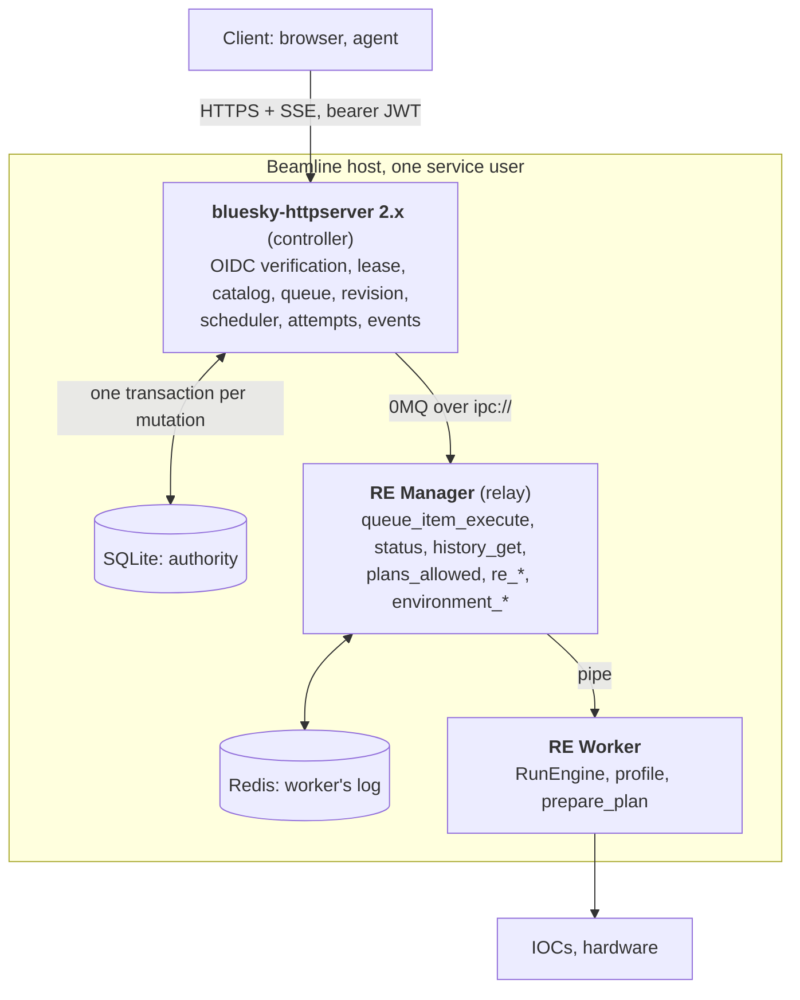

# bluesky-httpserver V2: feature requests by repository

Eight properties were presented to the team, and most were accepted (in substance) as something
that would be a good fit for bluesky-httpserver V2. This document describes the
minimum necessary additions to achieve the (mostly-)agreed upon result.

The delivery shape is a new major version of `bluesky-httpserver` that owns the queue and
acts as the controller, with RE Manager operating as a relay to the worker and
`bluesky-queueserver` receiving a small number of additions, each of which is also
useful to existing 0MQ deployments. The existing `bluesky-httpserver` code will
continue to exist.

This is the minimum version. The guiding rule: **a property needs a manager change
only if it changes what happens at execution time, and only if httpserver cannot get
the same information from the 0MQ API that already exists.** By that rule, seven of
the eight properties live entirely in httpserver, and the eighth needs one bug fix.

There are a set of feature requests that are far more extensive, but are not worth
considering yet until we can prove that this model works.

<!-- figure: v2_relay_architecture caption: Process and trust boundaries. The controller owns the queue and all durable state; the manager relays one item at a time to an unchanged worker. -->


The queue moves up into `bluesky-httpserver` because lease, revision, idempotency and events 
are all mutations *of the queue*; they can be atomic only where the queue lives, and the 
manager's API has no revision to check against. The manager's own queue is therefore always 
empty; only `queue_item_execute` is used, which runs one item and never requeues it
(`manager.py:2744-2766`; `plan_queue_ops.py:1853`).

**8 properties**, for reference:

1. Identity established by the server; rights are scopes
2. Closed, versioned operation catalog, not a namespace
3. Control is a lease on an identity; scheduling is separate authority
4. Optimistic concurrency on the queue
5. Durable transactional state, append-only audit, push not poll
6. Fail closed when an outcome cannot be proven
7. Explicit recovery; fenced worker authority
8. Idempotent mutations; honest readiness

## Decisions made in this document

- **Relay loss is handled by a timer**, not an operator action. If httpserver cannot
  reach the manager for longer than a configured grace window (default 60 s), a live
  attempt becomes `unknown` and dispatch blocks. The window must exceed the watchdog's
  manager-restart window (5–15 s, `start_manager.py:69, 217`) plus manager
  initialization, so an ordinary watchdog restart never trips it.
- **A clean `failed` is a scheduling policy, not a block.** Fail-closed is about
  unprovable outcomes; a `failed` reported by the worker with the RunEngine idle is
  fully proven. Each queue execution chooses `stop_on_failure` (default: the execution
  ends `stopped`, no block, no acknowledgement) or `continue_on_failure`. Neither ever
  retries the failed operation. `unknown` and `interrupted` always block.
- **Reattach is the manager's existing behaviour and is left alone.** After a manager
  restart the manager reconnects to its worker as it does today; httpserver verifies
  only what it can see (`running_item_uid`) and otherwise waits for evidence.
- **The worker's bounded self-stop on manager-loss is deferred**, together with
  an environment instance uid, correlated completion events, and an orphan policy.
  Each can be added later without changing anything here.

## Vocabulary

- **Controller** — `bluesky-httpserver` 2.x: one process per instrument that owns the
  public boundary, the queue and all durable control state.
- **Operation** — one submitted unit of intent, `(operation_id, operation_version,
  parameters)`, with one UID for its whole life.
- **Attempt** — one controller-authorized execution of an operation; its own UID; a
  retry is a new attempt.
- **Claim** — the controller's durable act of taking an operation off the pending queue
  and writing its attempt *before* calling the manager.
- **Queue execution** — the durable record that authorizes the scheduler to run admitted
  operations, independent of any client connection or lease.
- **Dispatch block** — a durable record that forbids claiming until an operator
  acknowledges; created on `unknown` or `interrupted` only.
- **Fence evidence** — the manager reporting nothing running, with the environment
  either present and idle or absent.

---

## A. `bluesky-queueserver`

Three changes, all small, none a new 0MQ method. Each stands on its own for standalone
0.x deployments: A1 gives any client a typed, reviewed catalog; A2 fixes a real bug;
A3 is a hardening option for any manager that sits behind a trusted front.

### A1. Operation catalog annotator — **blocking (P2)**

**Today.** `parameter_annotation_decorator` stores a parameter description on the plan
as `_custom_parameter_annotation_` (`annotation_decorator.py:68, 308`);
`qserver-list-plans-devices` renders it into `existing_plans_and_devices.yaml`
(`gen_lists.py:239, 353`); the manager serves it through `plans_existing` and
`plans_allowed`, and the worker validates items against it in `prepare_plan`
(`worker.py:491`; `profile_ops.py:3064`). There is no stable public id, version,
closed schema or device map.

**Change.** A second decorator that marks a plan as a catalogued operation:

```python
@operation(
    id="hxn.fly2d",
    version="1",
    request_model=Fly2DRequest,        # Pydantic model or JSON Schema dict
    devices={"detectors": {"xs": "xs", "merlin": "merlin"},
             "fast_axis": {"ssx": "zpssx", "ssy": "zpssy"}},   # logical id -> namespace name
)
def fly2d_operation(detectors, fast_axis, ...):
    yield from fly2dpd(...)
```

- The decorator records `_operation_descriptor_` on the callable: id, version, request
  JSON Schema with `additionalProperties: false`, device map, and a SHA-256 of the
  decorated function's source.
- `qserver-list-plans-devices` emits an `operations:` section alongside plans and
  devices, with a `catalog_sha256` over it; `plans_existing` / `plans_allowed` return it.
- `(id, version)` must be unique; a duplicate fails list generation.
- No execution-path change. The controller turns an operation into an ordinary plan
  item (name + kwargs with map values substituted) and the worker validates it as it
  validates any plan today.

**Acceptance.** A profile with one `@operation` plan produces a descriptor in the list
file and in `plans_allowed`; a duplicate `(id, version)` fails generation with a clear
message.

**Size.** S–M.

### A2. Detect a dead worker — **blocking (P6)**

**Today.** The manager polls the worker with `request_state` every 0.5 s
(`manager.py:731-742`). On timeout the call returns `None` (`manager.py:1544-1550`)
and the loop acts only on `ws is not None` (`742-743`). After a hard worker death
(SIGKILL, OOM, segfault) `running_item_uid`, `manager_state` and
`worker_environment_exists` freeze at their last values; the manager reports a running
plan on a dead worker until `environment_destroy` or a manager restart.
`environment_destroy` already has the right bookkeeping: it clears the environment and
records the running item with a diagnostic (`manager.py:657-686`).

**Change.** After `N` consecutive `None` results (default 6, ~3 s), call
`_is_worker_alive()`. If the worker is dead, run the `environment_destroy` bookkeeping
with a distinct diagnostic (`"RE Worker process terminated unexpectedly"`), set
`worker_environment_exists=False`, return the manager to idle, and publish status.

**Acceptance.** SIGKILL the worker mid-plan: within ~5 s `status` shows
`worker_environment_exists=False` and `manager_state=idle`, and `history_get` contains
the item with the diagnostic and whatever run UIDs were known. `environment_open` then
succeeds.

**Size.** S. One branch in the poll loop.

### A3. Controller-fronted mode — **blocking (P1, security)**

**Today.** The manager binds `tcp://*:60615` by default; CURVE uses a fixed client key
pair (`comms.py:18-19`), so encryption authenticates nobody; `user` and `user_group`
are request fields the manager accepts as given (`manager.py:2209-2222`). Any process
that reaches the socket is the controller.

**Change.** A configuration flag `controller_fronted: true` under which the manager:

- refuses to start unless both the control and info sockets are bound to `ipc://`
  paths;
- returns `{"success": false, "msg": "disabled in controller-fronted mode"}` from
  `queue_item_add`, `queue_item_add_batch`, `queue_item_update`, `queue_item_move*`,
  `queue_item_remove*`, `queue_clear`, `queue_start`, `queue_stop`, `queue_autostart`,
  `queue_mode_set`, `script_upload`, `function_execute`, `permissions_set`,
  `permissions_reload`, `environment_update`, `lock`, `unlock`, and changes no state;
- keeps `ping`, `status`, `config_get`, `plans_existing`, `plans_allowed`,
  `devices_existing`, `devices_allowed`, `queue_item_execute`, `history_get`,
  `history_clear`, `re_pause`, `re_resume`, `re_stop`, `re_abort`, `re_halt`,
  `re_runs`, `environment_open`, `environment_close`, `environment_destroy`.

Who may connect is then a filesystem question: the deployment runs manager and
controller as one dedicated user with the socket directory at `0700`.

**Acceptance.** With the flag set and a `tcp://` address configured, startup fails with
a clear message; each disabled method returns the error and leaves queue, history and
environment unchanged; the kept methods behave as before.

**Size.** S.

---

## B. `bluesky-httpserver` 2.x

Today httpserver is a stateless front: it authenticates, maps roles to scopes, and
forwards most routes one-to-one to 0MQ methods (`routers/core_api.py`;
`comm_base.py:24-81`). In 2.x it owns the queue and all durable control state and uses
the manager only through the methods A3 leaves enabled.

### B1. Make identity-provider verification the only credential path — **blocking (P1)**

**Today.** The auth stack is capable (OIDC/Entra/SAML/LDAP/PAM, hashed API keys,
sessions, 25 scopes). The issue is the trust root. After any authenticator succeeds,
httpserver mints its own HS256 tokens from secrets it holds (`authentication.py:71,
141-158`); HS256 is symmetric, so the exposed host carries a key that forges any user
with any scope. A JWKS-verifying path already exists in `ProxiedOIDCAuthenticator`
(`authenticators.py:192-200`), but `decode_token` tries the local secrets first and
falls through to it only when they fail (`authentication.py:152-176`). Defaults assume
a LAN: no providers → a single-user key with `write:scripts`; anonymous → `read:status`;
the default `user` role has `write:execute` (`authorization/_defaults.py`).

**Change.** A resource-server mode in which the existing IdP verification is the only
credential: bearer JWTs from the facility IdP, checked against issuer, audience, JWKS,
`exp`/`iat`/`nbf` with bounded skew; principal is `sub`; rights are three fixed scopes,
`queueserver:read` ⊂ `queueserver:control` ⊂ `queueserver:admin`, from the `scope`
claim or a configured mapping. No local secrets, token issuance, API keys, single-user
key or anonymous principal; no valid IdP token → 401. The existing mode remains for 0.x.

**Acceptance.** Unknown key, wrong issuer/audience, expired, missing `sub`, or a token
minted with a former local secret → 401 before any handler; `read` cannot reach a
mutating route → 403; a body naming an actor → 422; the configuration contains no
signing secret.

**Size.** S–M; the verification exists, the work is removing the fallbacks.

**Raise early.** Agents use httpserver-issued API keys today; here they need IdP
machine tokens (client-credentials or device flow). If the facility IdP will not issue
them, that is a blocker; a local API-key store is not the fix.

### B2. Public operation API — **blocking (P2)**

**Change.** `/api/v2`:

- `GET /catalog` — the descriptors from `plans_allowed` for the configured user group,
  with `catalog_sha256`.
- `POST /operations` — body is exactly `{operation_id, operation_version, parameters}`;
  parameters validated against the descriptor schema before persistence; unknown
  `(id, version)` or out-of-schema → 422, nothing written.
- `PUT /operations/{uid}` (replace pending), `DELETE /operations/{uid}` (cancel
  pending), `POST /queue/reorder` (must name every pending operation once).
- `GET /queue`, `GET /operations/{uid}`, `GET /attempts/{uid}`,
  `GET /queue-executions/{uid}`.

No route forwards a raw 0MQ method; no plan names, scripts, functions, environment or
permissions routes exist in this mode.

**Acceptance.** The `/api/v2` OpenAPI document contains no path including `plan`,
`script`, `function`, `environment`, `permissions`, `zmq`; rejected submissions do not
advance the queue revision; a replaced operation keeps its UID with a `replaced_by`
link.

**Size.** M.

### B3. Control lease and queue execution — **blocking (P3)**

**Change.**

- **Lease.** One per instrument, bound to the authenticated principal, TTL 5 s–1 h,
  acquire/renew/release, admin override with a recorded reason. Submit, replace,
  cancel, reorder, start/stop execution, safe-stop and recovery acknowledgement require
  the caller's active lease; another principal gets 403.
- **Queue execution.** `POST /queue-executions` records initiator, policy and the
  admitted operations. Pending work is admitted at start and as it is added while the
  execution is `running`. The record authorizes the scheduler; admitted work continues
  after the client disconnects or the lease expires. Pending work stays editable;
  claimed and running work is immutable. `POST /queue-executions/{uid}/stop` means stop
  after the current attempt. States: `running`, `stopping`, `completed`, `stopped`,
  `blocked`.
- **Failure policy** per execution: `stop_on_failure` (default) or
  `continue_on_failure`. Under either, a `failed` attempt is never retried. `unknown`
  and `interrupted` block regardless of policy. `aborted` (operator safe-stop) stops the
  execution.

**Acceptance.** (1) Live add/replace/reorder during a running execution is picked up in
order; no operation is claimed twice. (2) Lease expiry mid-execution: admitted work
completes; edits are 403 until a lease is acquired. (3) `stop` leaves remaining work
`queued`, execution `stopped`. (4) A second concurrent start → 409. (5) Under
`continue_on_failure` the next operation runs after a `failed`; under
`stop_on_failure` the execution ends `stopped` with no block.

**Size.** L.

### B4. Queue revision, ETags, idempotency, request ids — **blocking (P4, P8)**

**Change.** One monotonic `queue_revision`, bumped by every client or scheduler change
in the same transaction; `ETag: "qrev-N"` on queue-bearing responses; `If-Match`
required on queue mutations (428 missing, 412 stale with current ETag, nothing
written); `Idempotency-Key` required on every mutation, scoped to (principal, method,
path), exact replay returns the stored response, conflicting reuse → 409;
`X-Request-ID` on every response; one error envelope
`{error: {code, message, details, request_id}}`.

**Acceptance.** Two clients with the same ETag: second write 412, queue unchanged; a
scheduler claim between a client's read and write makes the write 412; a replayed
submission creates no second operation; rejected requests never advance the revision.

**Size.** M.

### B5. Manager gateway and attempt lifecycle — **blocking (P6, P7)**

**Change.** One component owns the 0MQ control connection and the `QS_Info`
subscription and is the only code that speaks to the manager. It uses existing methods
only.

**Startup.**
- Connect; `status`; refuse to proceed unless the manager reports controller-fronted
  mode.
- `plans_allowed` for the configured user group → catalog; record `plans_allowed_uid`
  as the catalog uid. Refuse readiness if any persisted nonterminal operation names a
  descriptor that is missing or whose schema changed.
- If `worker_environment_exists` is false and no dispatch block is active,
  `environment_open` and wait for the environment.
- If an attempt is `claimed` or `running` in the store, go to **reconnect** below.

**Dispatch.**
- In one transaction: remove the operation from the pending queue, write the attempt
  row (operation, actor, revision), bump the revision, append `operation.claimed`.
- Then `queue_item_execute` with an ordinary plan item: `name` from the descriptor,
  `kwargs` from `parameters` with logical device ids replaced by the map's namespace
  names, `meta.attempt_uid` set, `user` = the submitting principal, `user_group` = the
  configured group. The worker's `prepare_plan` validates it as it validates any plan.
- Store the reply's `item_uid` on the attempt; mark attempt and operation `running`.
- A rejected reply (environment not idle, plan not allowed, validation failure) →
  attempt `failed` with the manager's message; policy decides whether the execution
  continues.

**Observe.** Status arrives on `QS_Info` whenever it changes (`manager.py:405-450`).
When `manager_state` returns to `idle` and `plan_history_uid` changed, `history_get`
the newest entries and match on `item_uid` (and `meta.attempt_uid`). Poll `status`
every few seconds as a fallback for dropped PUB messages. `re_runs` supplies run UIDs
for in-progress display.

**Outcome mapping** from the history entry's `exit_status`: `completed` →
`succeeded`; `stopped` → `succeeded` (Bluesky closed the run cleanly); `failed` →
`failed`; `aborted`, `halted` → `aborted`; the A2 diagnostic, or `unknown` (the
manager's own post-restart fallback, `manager.py:3950-3958`) → `unknown`.

**Unprovable → `unknown`, always with a dispatch block:**
- `queue_item_execute` timed out and, after the grace window, no history entry carries
  the attempt uid;
- `worker_environment_exists` became false while an attempt was live and no history
  entry explains it;
- `running_item_uid` is an item the store does not know (impossible with the door
  closed; treated as `unknown` for the live attempt and logged loudly);
- the manager has been unreachable for longer than the grace window while an attempt
  was live.

**Relay loss.** On REQ timeouts or a silent `QS_Info`: `/ready` → 503
(`worker: unreachable`), no claims, the live attempt untouched, the grace timer
started (default 60 s; must exceed watchdog restart + manager init). On reconnect
within the window: same `running_item_uid` → keep observing; idle and the item in
history → adopt the outcome; environment gone → `unknown` + block. On expiry: attempt
`unknown`, block. A manager that returns after expiry can only supply **evidence** — a
later history entry converts `unknown` into its terminal state and is recorded as such;
nothing converts `unknown` back into `running`.

**Reconnect after a controller restart** follows the same rules as relay loss, with
the stored `item_uid` as the thing verified.

**Safe stop.** `POST /attempts/{uid}/safe-stop` → `re_pause` (deferred) then
`re_abort`; the resulting `aborted` entry is handled like any other. A completion that
arrives first wins.

**Recovery.** A block clears only through `POST /recovery/acknowledge` with lease,
current revision and a non-blank note, and only once fence evidence exists: `status`
shows `manager_state=idle` and no `running_item_uid`. Record `worker.fenced` with the
observed status. After acknowledgement the execution is `stopped`, remaining work is
left `queued`, and — only now, only through the gateway — `environment_open` if the
environment is absent. There is no public environment route.

**Never allowed:** `environment_open` while a block is active; inferring success from
`manager_state=idle` without the history entry; flipping `unknown` to `running`;
retrying or re-queuing any attempt automatically.

**Acceptance.** Against a fake manager that can inject faults: execute timeout with no
history entry, environment lost mid-attempt, unknown `running_item_uid`, relay silence
past the grace window — each yields exactly one `unknown` attempt, one block, one
`blocked` execution and no further `queue_item_execute`. Relay silence shorter than the
window with the same `running_item_uid` leaves the attempt `running` and it completes
normally. Relay silence during which the plan finished adopts the history result with
no block. Acknowledgement fails while `running_item_uid` is set and succeeds once idle;
`environment_open` is called only after acknowledgement.

**Size.** L. This is the core of the controller.

### B6. Durable store, events, SSE — **blocking (P5)**

**Change.** SQLite in WAL mode on a local filesystem (network filesystems refused at
startup), one exclusive lock file so a second controller cannot open the same database.
Every mutation — client or scheduler — is one transaction writing the domain change, the
revision, the actor and an append-only event with a monotonic id, actor
(principal/scheduler/system), related UIDs, revision and typed payload.
`GET /events?after=&limit=` and `GET /events/stream` with `Last-Event-ID` resume, a
heartbeat comment, and closure at token expiry. Schema migrations with checksums;
`backup`/`restore`/`migrate` CLI requiring the controller to be stopped. No Bluesky
documents stored; run UIDs only.

**Acceptance.** Kill the controller mid-execution and restart it: every operation,
attempt, lease and event is present; `GET /events?after=0` replays the full sequence; an
SSE client reconnecting with `Last-Event-ID` misses nothing; a second controller on the
same database refuses to start.

**Size.** L. **Deployment note:** one controller per instrument, state on local disk.
Central multi-instrument hosting would need a different store and a leader lock; out
of scope.

### B7. Readiness and health — **blocking (P8)**

**Change.** `/health` (process answers) and `/ready` (200 only when the manager is
reachable, the environment exists, the catalog is compatible with persisted work, no
block is active, and dispatch is possible; otherwise 503 with those five coarse fields
and nothing else). Unauthenticated; no principals, PIDs, addresses or paths.

**Acceptance.** Stop the manager: `/ready` → 503 `worker: unreachable` without the
0MQ address; an active block → 503 `dispatch: blocked`.

**Size.** S.

### B8. No pass-through routes in v2 mode — **blocking (security)**

**Change.** Do not mount `routers/core_api.py`'s raw forwards in resource-server mode.
Add a test that walks the router and fails if any route other than `/health` and
`/ready` lacks an explicit principal dependency (`/plans/existing` is the precedent,
`core_api.py:740-743`).

**Size.** S.

---

## C. `bluesky-queueserver-api`

### C1. V2 client

A `QueueServerClient` (sync and async) for `/api/v2`: caller-supplied bearer token;
`catalog()`; `submit(operation_id, version, parameters)` validated client-side against
the descriptor; automatic `If-Match` from the last seen ETag with a typed
`StaleRevision` error; automatic `Idempotency-Key`; lease helpers; `start_execution`,
`stop_after_current`, `safe_stop`, `acknowledge_recovery`; `events(after=)` and an SSE
iterator with cursor resume. No plan-name, script, function or environment calls.

**Acceptance.** A command-line walkthrough (take control, submit, start, stream events,
observe a failure, acknowledge) in under 100 lines on top of the client; the SSE
iterator resumes across a server restart.

**Size.** M. The 0.x client is unchanged and documented as not a `/api/v2` client.

---

## D. Cross-repository

### D1. Version coupling

httpserver 2.x declares the minimum `bluesky-queueserver` providing A1–A3 and refuses
to start against a manager that does not report controller-fronted mode. Today the
dependency is unpinned (`bluesky-httpserver/pyproject.toml:16-19`).

### D2. Deployment reference

Manager and controller on one host as one dedicated service user; manager in
controller-fronted mode on `ipc://` sockets in a `0700` directory; httpserver 2.x
behind a reverse proxy with TLS termination and rate limits; IdP JWKS reachable
outbound only; SQLite on local disk; the manager's existing watchdog unchanged;
systemd units for both. A security review of this reference precedes internet exposure.

### D3. Offline adapter generator (nice to have)

A tool that reads `existing_plans_and_devices.yaml` and existing annotations and emits
draft `@operation` declarations for review.

---

## Added later, without redesign

Each is an independent improvement on top of the above:

- `item_completed` / `item_started` messages on `QS_Info`, replacing history scanning.
- An environment instance uid in `status`, strengthening the fence and reattach checks.
- The worker's bounded self-stop: a silence timer, a per-operation orphan
  policy (`continue` / `request-stop`) and a result file, so a plan with no manager
  present is stopped or recorded within a bounded time.
- Worker-side enforcement of the operation catalog and device map, so the catalog holds
  at the 0MQ socket as well as at the HTTPS door.
- A catalog revision hash covering the profile source, for drift detection stronger
  than `plans_allowed_uid`.
- Loop mode, instructions, batch submission in the controller.

## What this accepts

- The catalog is enforced at the HTTPS door, not in the worker. The closed socket is a
  deployment guarantee, enforced by A3's refusal to bind `tcp://`.
- The fence is "the manager reports idle," not a reap or a lock. Adequate with A2 and a
  closed door.
- Two stores: Redis holds the worker's log; SQLite is the authority; httpserver never
  writes Redis.
- No bound yet on how long a plan runs with no controller present — today's behavior.
- Manager-side reattach after a manager restart uses the manager's existing
  Redis-vs-worker comparison, which warns rather than fails on mismatch.
- Drift between catalog and profile is caught through `plans_allowed_uid`, not a
  content hash.

## Suggested order

1. **A1 + A2 + A3** — small, independent, testable with a script, and useful to 0.x on
   their own.
2. **B6 + B4 + B3** — store, revision, lease; build against an in-memory fake manager.
3. **B5 + B7** — gateway, lifecycle, recovery, readiness; the fault matrix lives here.
4. **B1 + B2 + B8** — identity and the public surface; must land before exposure.
5. **C1**, then **D2** and the security review.
