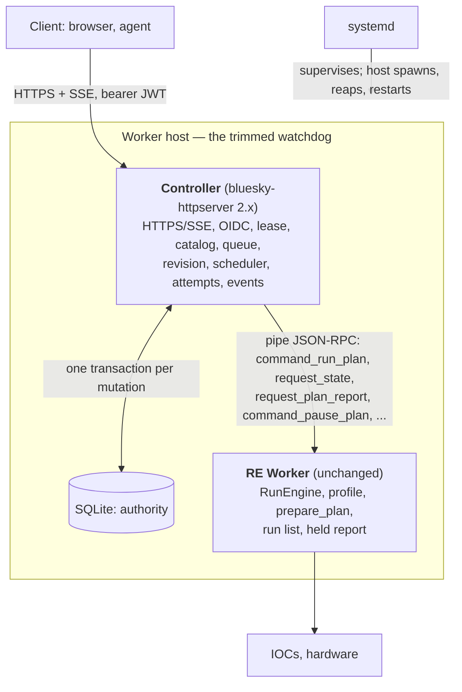

# bluesky-httpserver V2, alternative shape: the controller drives the worker directly

Companion to [`V2_FEATURE_REQUESTS.md`](V2_FEATURE_REQUESTS.md) (the "layered" design,
in which RE Manager stays in the path as a relay). This document describes the other
way to satisfy the same eight properties with the same public API: **the controller
replaces RE Manager, keeps RE Worker unchanged, and drives it over the pipe protocol
the worker already speaks.** The watchdog is kept, trimmed to its essential job, so
that a controller restart can reattach to a running worker.

Everything about the public boundary (B1–B4, B6–B8), the client (C1) and the
operation annotator (A1) is identical to the layered document and is not repeated.
So are its two decisions: a clean `failed` is a per-execution policy
(`stop_on_failure` default, `continue_on_failure` opt-in, never a retry), and
`unknown`/`interrupted` always block. What changes is the private half: how the
controller reaches the RunEngine, and what happens when something in that chain dies.

<!-- figure: v2_worker_host_architecture caption: Process tree. The host (trimmed watchdog) spawns both children and holds the pipe ends; the controller drives the unchanged worker directly. -->

Not in this picture: `manager.py`, `plan_queue_ops.py`, Redis, the 0MQ control and
info sockets, `qserver` CLI access to the live instrument. All remain in the package
for standalone 0.x deployments; none run in this mode.

## Why this shape

In the layered design the manager's job shrinks to "spawn the worker, validate and
forward one plan at a time, relay status." Most of the intricate parts of that
document — three disconnect cases, three ordered timeouts, three dead drops,
instance identity as a fence substitute, ZAP and `ipc://` to close a second door —
exist because the controller does not own that relay. Here the relay is removed:

| | Layered (relay kept) | This document |
|---|---|---|
| Links the controller depends on | controller↔manager (0MQ), manager↔worker (pipe) | controller↔worker (pipe), controller↔host (pipe) |
| Doors into the instrument | HTTPS + 0MQ (must be closed with ZAP/`ipc://`) | HTTPS only; the pipe is an inherited fd |
| Stores | SQLite + Redis | SQLite |
| Fence for a dead worker | instance uid changed, or history entry present | the host **reaps** the worker (`waitpid`) — a real fence |
| Timeouts to keep ordered | watchdog restart << grace << `T_w` | host restart << `T_w` |
| Disconnect cases | worker lost / relay lost / controller restarted | worker lost / controller restarted (host lost = everything stops) |
| Identity verification on reattach | twice (manager→worker, controller→manager) | once (controller→worker) |
| Plan validation | manager `_prepare_item` + worker `prepare_plan` | worker `prepare_plan` only (already the case: `worker.py:491`) |
| Code kept unchanged | worker, profile_ops, annotations, manager, watchdog | worker, profile_ops, annotations; watchdog trimmed |
| Code superseded in this mode | — | `manager.py`, `plan_queue_ops.py`, 0MQ comms |

What it costs relative to the layered design: the manager's own operator surface
(`qserver` CLI, `environment_*`, pause/resume over 0MQ) is not available against a
controller-run worker; everything goes through the controller's HTTPS API. That is
the one-door property, stated as a cost.

## Vocabulary

As in the layered document, plus:

- **Worker host** — the trimmed watchdog: the root process of the deployment. It
  creates the pipes, spawns the controller and the worker as children, holds the pipe
  ends so the worker survives a controller restart, restarts the controller, reaps the
  worker, and kills everything on its own exit. It has no opinion about plans, queues
  or policy.
- **Reattach** — a restarted controller resuming use of the worker pipe the host kept
  open. Permitted only after the controller verifies the worker's environment instance
  uid and running attempt against its own durable record.
- **Result file** — a small file the worker writes before it exits on its own, so that
  a plan that finished (or was stopped) with no controller present still leaves a
  complete record.

## What exists today that this design reuses

- The worker is a `multiprocessing.Process` constructed with one pipe end
  (`start_manager.py:105-113`) and serves a JSON-RPC surface over it
  (`worker.py:1382-1404`): `command_run_plan`, `request_state`,
  `request_plan_report`, `request_run_list`, `command_pause_plan`,
  `command_continue_plan`, `command_close_env`, `command_confirm_exit`, and others.
- The manager talks to it with an asyncio client, `PipeJsonRpcSendAsync`
  (`comms.py:339`), e.g. `send_msg("command_run_plan", ...)`,
  `send_msg("request_plan_report")` (`manager.py:1562`), `send_msg("command_pause_plan",
  ...)` (`manager.py:1676`). The controller is an asyncio process; it can hold the
  same client.
- Plan validation, signature binding and device-name resolution happen **in the
  worker** via `prepare_plan` (`worker.py:491`; `profile_ops.py:885-1048`). The
  controller never needs `profile_ops`.
- The worker holds a plan's completion report until it is fetched
  (`worker.py:149, 925, 963-971`) and keeps a run list with run UIDs and scan ids.
  This is what makes reattach after a short gap lossless.
- The watchdog already spawns, kills, joins and reports liveness of the worker on
  request (`start_manager.py:98-148`) and restarts its other child on a heartbeat gap
  (`start_manager.py:201-221`).

## Process tree and failure story

One durable authority (the controller's SQLite), one execution process (the worker),
one holder (the host). Four things can die.

**Worker dies (crash, OOM, SIGKILL).** The host, as parent, sees it: `is_alive()` is
false and `join()` reaps it. The controller's next `request_state` times out; it asks
the host, gets "not alive", and marks the running attempt `unknown` — unless a result
file exists (worker stopped itself in an orderly way), in which case that is the
outcome. Dispatch blocks; fence evidence is the reap itself; an operator acknowledges;
the controller asks the host to spawn a new worker. Nothing is inferred.

**Controller dies and the host restarts it within `T_w` (tier 1).** The worker never
noticed: the host still holds the pipe end, and the plan kept running. The new
controller reads its SQLite record (attempt A on instance E, `running`), then asks the
worker `request_state`: instance uid and running attempt. Match → **reattach**: resume
observing (and, by policy, controlling), fetch any held report, append a
`controller.restarted` event with the observation gap. Mismatch or no record →
`unknown` with the run UIDs the worker can report, block, no new work until the
environment is recycled after acknowledgement. No warning-and-continue path exists.

**Controller stays dead past `T_w` (tier 2).** The worker's silence timer fires (no
`request_state` for `T_w`). It applies the running operation's orphan policy:
`continue` → finish the plan; `request-stop` → pause at the next checkpoint and stop.
Either way, once the RunEngine is idle it writes the result file and exits. The host
reaps it. Whenever a controller next starts, it finds the attempt `running` in SQLite
and the result file on disk, records the real outcome, blocks for acknowledgement, and
spawns a fresh worker afterwards. The plan was not lost; control over it was, for at
most `T_w`.

**Host dies.** Its exit handlers kill both children (`start_manager.py:860-868`); the
pipe ends vanish; the worker's receiver sees EOF. Today that EOF is swallowed
(`comms.py:247-248`); here it must be treated as "the whole deployment is going down":
request a RunEngine pause, write the result file if there is time, exit. systemd
restarts the host, which starts a controller, which finds the `running` attempt and
either the result file or nothing, and blocks accordingly. The host is tiny and
single-purpose precisely so that this is rare.

What cannot happen in this tree: two processes believing they own the RunEngine. Only
the host spawns workers, it spawns one, and it will not spawn another until it has
reaped the first.

## Plan continuity: two policies for a restarted controller

Both are built on the same mechanics (reattach via the host-held pipe; silence timer
and result file in the worker). They differ in what a restarted controller is allowed
to do with an attempt that was already running when it came up. This is the
property-7 decision in this design, and it can be a deployment setting.

**Resume (reattach and control).** After verification the controller treats the
attempt as its own again: it may safe-stop it, it fetches the report when the plan
ends, and the attempt completes normally with a `controller.restarted` event in its
history. This is the authors' preferred behaviour and the default proposed here. Its
premise is that verification by instance uid and attempt uid is sufficient to prove
"this is the plan I authorized."

**Observe only (`continue` + result file).** After verification the controller reads
from the worker (`request_state`, `request_run_list`, `request_plan_report`) but sends
it no control commands for that attempt; the attempt is `unknown` until the plan ends
on its own, at which point the fetched report (or, if the worker exits first, the
result file) supplies the terminal state with evidence. Dispatch is blocked until an
operator acknowledges. Plan continuity is preserved — the scan finishes and the data is
collected — but a process that was not present when the plan started never takes
control of it. This is the conservative reading of property 7, and it is also exactly
what happens under *Resume* when verification fails, and what happens in tier 2
regardless of policy.

The orphan policy on the operation (`continue` vs `request-stop`) is orthogonal: it
decides what the worker does when no controller returns within `T_w`. A deployment
that wants maximum continuity picks *Resume* plus `continue`; one that wants a restarted
process to never touch running hardware picks *Observe only*; `request-stop` is for
operations whose owners would rather lose the scan than run it unsupervised.

---

## E. `bluesky-queueserver` changes

### E1. Operation catalog annotator — **blocking (P2)**

Identical to A1 in the layered document. The descriptor is read by the worker when it
loads the profile; `request_plans_and_devices_list` (existing) is extended to return the
catalog and `catalog_sha256` so the controller can publish it.

### E2. Run a catalogued operation over the pipe — **blocking (P2, P6)**

**Today.** `command_run_plan(plan_info)` runs a plan item; the worker calls
`prepare_plan` to validate and bind it (`worker.py:491, 1089`). `request_state`
reports `running_item_uid`, `re_state`, `re_report_available` and more
(`worker.py:915-949`).

**Change.**
- `command_run_plan` accepts `item_type: "operation"` with
  `{operation_id, operation_version, parameters, attempt_uid}`; the worker validates
  parameters against the descriptor schema, resolves devices through the declared map
  only (no attribute-path traversal for operations), and runs the plan via the existing
  path. Rejections return distinct codes: unknown operation, schema violation, device
  not in map, not idle.
- `attempt_uid` is stored with the running item and included in `request_state`, in
  the held report, and in the result file.
- The worker generates an `environment_instance_uid` at startup and reports it in
  `request_state`. It is never regenerated while the process lives.

**Acceptance.** A valid operation runs and the report carries `attempt_uid` and run
UIDs; each rejection is reachable from a test and leaves the worker idle;
`request_state` returns the same instance uid before and after a (simulated)
controller restart.

**Size.** S–M. The descriptor and device-map logic is shared with A1 of the layered
document; the pipe plumbing is additive.

### E3. Worker host: the watchdog, trimmed — **blocking (P7)**

**Today.** `WatchdogProcess` creates both pipes (`start_manager.py:75-79`), spawns the
manager and, on request, the worker (`98-117`), joins or kills the worker on request
(`119-139`), reports liveness (`141-148`), and restarts the manager on a heartbeat gap
(`201-221`). Two defects: it restarts only while "enabled", and enabling happens only
after the child finishes initialization (`171`, `94-95`, `208-209`), so a child that
dies during initialization is never restarted; and the restart condition is a window,
`5 s ≤ gap ≤ 15 s` (`217-218`), so a gap noticed late never triggers.

**Change.** A `worker_host` module providing the same process with the manager
replaced by the controller and the two defects fixed:

- Spawns the controller as its child, passing the controller's pipe end to the worker
  and a host pipe for `start_worker`, `kill_worker`, `join_worker`, `is_worker_alive`,
  `heartbeat`, `stopping`.
- Restarts the controller **unconditionally** on process exit (`not is_alive()`),
  with exponential backoff and a cap, independent of any enable flag. Keeps the
  heartbeat only to detect a hung event loop, using a monotonic clock and a threshold,
  not a window.
- Spawns at most one worker; refuses `start_worker` while a previous worker has not
  been reaped (`join`). This is the "no second authority" rule enforced at the only
  place that can enforce it.
- Reports, on `is_worker_alive`, the worker PID, exit code if reaped, and the host's
  own start time, so the controller can tell "same host, same worker" from "fresh
  host".
- Kills both children on its own exit (today's `atexit`/`SIGTERM` handlers), and is
  itself supervised by systemd with `Restart=on-failure`.
- Contains no queue, plan, Redis, 0MQ or policy logic.

**Acceptance.** (1) Kill the controller during its initialization; the host restarts
it. (2) Suspend the host for 60 s with `SIGSTOP`, resume; it restarts a controller
whose heartbeat gap exceeded the old window. (3) `start_worker` while a worker is
alive is refused; after the worker exits and is joined, it succeeds. (4) Kill the host;
both children are gone within a second.

**Size.** S–M. Mostly deletion from `start_manager.py`.

### E4. Worker orphan handling: silence timer, EOF, result file — **blocking (P7)**

**Today.** The worker's receiver waits for messages and does nothing with their
absence; on `EOFError` it `pass`es (`comms.py:236-248`). The manager's
`request_state` every 0.5 s (`manager.py:731-742`) is a liveness signal the worker
ignores.

**Change.**
- Record the time of the last message from the controller; `request_state` suffices.
- Configurable `manager_silence_timeout` `T_w` (name kept for continuity; default
  120 s; minimum 30 s; must exceed the host's controller-restart window plus
  controller initialization). Required in this mode.
- On silence past `T_w` **with a plan running**: apply the operation's orphan policy
  (`continue` → finish; `request-stop` → `RE.request_pause(defer=True)` then stop,
  `exit_status="aborted"`, reason `controller_lost`). When the RunEngine is idle,
  write the **result file** (item uid, attempt uid, instance uid, run UIDs, scan ids,
  exit status, reason, times) to a configured directory with an atomic rename, then
  exit with a distinct code. Legacy plans use `continue`.
- On silence past `T_w` **while idle**: exit.
- On pipe **EOF**: the host is gone and everything is being killed; request a pause,
  write the result file if the RunEngine becomes idle in time, exit. Never `pass`.
- The decision is irrevocable once stopping begins; a controller that reattaches during
  the stop records what the worker reports.

**Acceptance.** (1) Controller killed and not restarted (host stopped): with
`request-stop`, the worker stops at the next checkpoint within `T_w`, writes the file,
exits; with `continue`, it finishes, writes the file, exits. (2) Controller killed and
restarted by the host within `T_w`: no file, no exit, same instance uid, plan completes.
(3) Host killed: the worker exits promptly and, if the plan reached a checkpoint, a
result file exists. (4) `T_w` below the minimum refuses to start.

**Size.** M. These are the "tier 2" mechanics the layered document defers; this design
needs them regardless of policy.

### E5. Not used in this mode

`manager.py`, `plan_queue_ops.py`, Redis, the 0MQ control and info sockets, `qserver`,
`start-re-manager`. All remain for standalone 0.x deployments. No compatibility shim
connects them to the controller.

---

## F. Controller changes relative to the layered document

B1 (identity), B2 (public operation API), B3 (lease, queue execution, failure policy),
B4 (revision, ETags, idempotency), B6 (durable store, events, SSE), B7 (readiness) and
B8 (no pass-through routes) apply unchanged. B5 is replaced by the following.

### F1. Worker gateway over the pipe — **blocking (P6)**

**Change.** One component owns the host pipe and the worker pipe and is the only code
that speaks to either.

- **Startup.** Ask the host `is_worker_alive`. If no worker: `start_worker`, wait for
  the environment to open, read the catalog and `catalog_sha256`, record the instance
  uid. If a worker is alive: this is a restart — go to **reattach** below before
  anything else. Refuse to become ready if the catalog cannot execute any persisted
  nonterminal operation.
- **Claim before contact.** As in the layered B5: one transaction removes the operation
  from the pending queue, writes the attempt row (operation, instance uid, actor,
  revision), bumps the revision, appends `operation.claimed`. Only then
  `command_run_plan` with the attempt uid.
- **Running.** An accepted `command_run_plan` marks the attempt `running`. Poll
  `request_state` every 0.5 s (what the manager does today; the pipe is local). When
  `re_report_available`, fetch `request_plan_report`; the report's `attempt_uid` and
  instance uid must match. `request_run_list` supplies run UIDs for in-progress
  display.
- **Outcome mapping.** Report `success` → `succeeded`; `failed` → `failed`;
  `aborted`/`halted` → `aborted`; `controller_lost` (from a result file) →
  `interrupted`. Unprovable → `unknown`: report with mismatched attempt or instance uid,
  worker not alive with no result file, instance uid change while an attempt is live.
  `unknown` and `interrupted` block dispatch and stop the queue execution; a clean
  `failed` follows the execution's failure policy (B3).
- **Reattach (controller restarted, worker alive).** Read the SQLite attempt in
  `claimed`/`running`. `request_state` → instance uid and running attempt uid.
  - Same instance, same attempt → apply the deployment's continuity policy (*Resume*
    or *Observe only*, above); append `controller.restarted{gap_seconds}`.
  - Same instance, worker idle, `re_report_available` → fetch the report; that is the
    outcome; no acknowledgement needed if it is a success.
  - Anything else (different instance, different attempt, no record for what is
    running) → attempt `unknown` carrying the worker's run list; block with
    `requires_fence`; no control commands to the worker except safe-stop.
- **Worker lost.** `request_state` times out → `is_worker_alive` false → `join_worker`
  (the reap). Check the result directory for the attempt; if a file exists, ingest it;
  else `unknown`. Block; fence evidence is the reap.
- **Safe stop.** `POST /attempts/{uid}/safe-stop` → `command_pause_plan` with the
  deferred option, then stop; the resulting `aborted` report is handled like any other.
- **Never allowed:** `start_worker` while a block is active; `start_worker` while the
  host reports a live or unreaped worker; flipping `unknown` to `running` on anything
  but a verified same-instance, same-attempt match; inferring success without a report
  or result file.

**Acceptance.** Against a fake worker that can inject faults (report with wrong attempt
uid, wrong instance uid, malformed report, process exit mid-plan, pipe timeout) each
yields exactly one `unknown` attempt, one block, one `blocked` execution and no further
`command_run_plan`. Kill the controller mid-plan and let the host restart it: under
*Resume* the attempt stays `running`, a `controller.restarted` event appears, and the
plan completes with a normal report; under *Observe only* the attempt is `unknown`
until the report arrives, then takes the report's state and waits for acknowledgement.
Kill the controller and stop the host for longer than `T_w`: on restart the result file
is ingested and the attempt is `interrupted` or `succeeded` per its contents.

**Size.** L, but smaller than the layered B5: one link, no relay, no grace window.

### F2. Fence by reap; explicit recovery — **blocking (P7)**

**Change.** A block for `unknown`/`interrupted` requires fence evidence: the host has
reaped the worker (exit code known), **or** the attempt has a report or result file,
**or** the instance uid has changed. Record it as `worker.fenced{method: reap |
report | result-file | instance}`. A clean `failed` needs acknowledgement only.

`POST /recovery/acknowledge` requires lease, current revision, a non-blank note and the
evidence. After acknowledgement: block cleared, execution `stopped`, remaining queued
work left `queued`. Only then, and only through the host, does the controller recycle
the environment: `start_worker` if none is alive; `kill_worker` + `join_worker` +
`start_worker` if a worker is alive but flagged mismatched (after the operator has
safe-stopped or waited it out). No public route exists for any of these.

**Acceptance.** Acknowledgement fails while the worker is alive and unreaped with no
report; succeeds after reap or report; a mismatched environment is recycled only after
acknowledgement and shows a new instance uid; the OpenAPI document never contains an
environment route.

**Size.** M.

### F3. Readiness components — **blocking (P8)**

`/ready` reports five coarse fields: `host` (pipe answering), `worker` (alive and
catalog loaded), `catalog` (compatible with persisted work), `fencing` (clear or
required), `dispatch` (ready or blocked). 503 if any is not ready; nothing else is
exposed.

### F4. Packaging — **decision needed**

The controller spawns and drives `RunEngineWorker`, so it imports
`bluesky_queueserver`. Two reasonable placements:

- `bluesky-httpserver` 2.x contains the controller and the entry point; it imports
  `worker_host` and `RunEngineWorker` from `bluesky-queueserver`. Matches the team's
  framing ("a V2 of httpserver"); makes httpserver depend on queueserver at import
  time, which it already does at runtime.
- `bluesky-queueserver` gains a `controller` subpackage and entry point; httpserver
  2.x becomes thin or is folded in. Fewer repositories in the critical path; less
  aligned with the framing.

Either way the version coupling in D1 of the layered document applies, and the
worker/host interface is private to the two packages.

---

## Decision points

Fewer than in the layered design:

1. **Continuity policy default** — *Resume* (authors' preference) or *Observe only*
   (conservative). Deployment setting; pick the default.
2. **`T_w` default** and its relation to the host's restart window.
3. **Clean `failed`** — decided as in the layered document: per-execution policy.
4. **Packaging** (F4).

Gone from the list: the controller grace window (no relay to lose), the second-door
work (A4, A7), the instance-identity fence heuristic (replaced by a reap), the
manager-side verification (A5's reattach logic moves into the controller, against its
own store).

## Suggested order

1. **E3** — the trimmed host, with its two defects fixed. Testable alone with a dummy
   child.
2. **E2 + E4** — operation execution over the pipe, instance uid, silence timer, EOF
   handling, result file. Testable with a script that plays controller.
3. **B7 + B4 + B3** — store, revision, lease, as in the layered document.
4. **F1 + F2 + F3** — the gateway, recovery, readiness; the fault matrix lives here.
5. **B1 + B2 + B9** — identity and the public surface.
6. **E1** can proceed in parallel from step 2; **C1** last.

## What this gives up

- The manager's standalone operator surface against the live worker. Operators use the
  controller's API or the controller's admin CLI; there is no `qserver` path to a
  controller-run worker.
- The manager's queue features that the controller does not reproduce in its first
  version: loop mode, instructions, batch upload. `ignore_failures` is covered by the
  `continue_on_failure` execution policy.
- Compatibility with `bluesky-queueserver-api` 0.x clients for controller-run
  instruments. The layered design does not provide this either once the 0MQ door is
  closed; here it is simply absent.
- Portability of the host beyond POSIX: `multiprocessing` pipes and `waitpid`
  semantics are assumed. Standalone 0.x is unaffected.
